## Introduction


This document outlines the design of OpenSSL 3.0, the next version of
OpenSSL after 1.1.1. It assumes familiarity with the document entitled
_OpenSSL Strategic Architecture_ and a working knowledge of OpenSSL
1.1.x.

The OpenSSL 3.0 release will have minimal impact to the vast majority
of existing applications; almost all well-behaved applications will
just need to be recompiled.

The majority of the changes in OpenSSL 3.0 are internal architectural
restructuring to facilitate a long-term supportable cryptographic
framework that enables better separation of algorithm implementations
from algorithm APIs. These structural changes also support a more
maintainable OpenSSL FIPS Cryptographic Module 3.0.

No currently marked deprecated APIs will be removed in OpenSSL 3.0.

Many additional low-level functions will be marked as deprecated APIs
in OpenSSL 3.0.

OpenSSL 3.0 will support an application having TLS connections that
are in FIPS mode (using the OpenSSL FIPS Cryptographic Module 3.0) and
TLS connections that are in non-FIPS mode simultaneously.

## Terms Used in This Document {#terms-used-in-this-document}

The following terms, in alphabetical order,  are used in this
document.  A brief (summary) definition is provided.


*   **Algorithm**, or sometimes **cryptographic algorithm**, is a
    method to perform a set of operations (such as encryption or
    decryption).  Our use of the term is abstract, and usually
    represents an algorithm by its name, such as "aes-128-cbc".
*   **Algorithm implementation**, or sometimes just
    **implementation**, is a concrete implementation of an algorithm.
    This is mainly represented in code in the form of a set of
    functions.
*   **CAVS** is the Cryptographic Algorithm Validation System. A tool
    used to test that a cryptographic implementation conforms to FIPS
    standards.
*   **CMVP** is the Cryptographic Module Validation Program. A process
    that validates that cryptographic implementations conform to FIPS
    standards.
*   **EVP** is a family of APIs implemented by libcrypto that enables
    applications to perform cryptographic operations. The
    implementation of the EVP API uses the Core and Provider
    components.
*   The **Core** is a component in libcrypto that enables applications
    to access the algorithm implementations offered by providers.
*   **CSP** is Critical Security Parameters. This includes any information (e.g.
    private keys, passwords, pin numbers etc) that might compromise the security
    of a module in the event of their unauthorised disclosure or modification.
*   **Explicit Fetch** is a method for finding an algorithm
    implementation where the application makes an explicit call to
    locate the implementation and supplies search criteria.
*   **FIPS** is the Federal Information Processing Standards. This is
    a set of standards defined by the US government. In particular,
    FIPS standard 140-2 is applicable to cryptographic software.
*   A **FIPS module** is an implementation of cryptographic algorithms
    that has been validated by the CMVP as conforming to FIPS
    standards. In OpenSSL the FIPS module is implemented as a provider
    and is available in dynamically loadable module form.
*   **Implicit Fetch** is a method for finding an algorithm
    implementation where the application does not explicitly make a
    call to locate the implementation and therefore default search
    criteria are used.
*   The **Integrity Check** is a test that is automatically run when
    the FIPS module is loaded. The module checksums itself and
    verifies that it hasn't been inadvertently altered.
*   **KAS** is Key Agreement Scheme. A method by which two communicating parties
    can agree a shared key between them.
*   **KAT**s are Known Answer Tests. A set of tests used to perform a
    health-check of a FIPS module.
*   **libcrypto** is a shared library implemented by OpenSSL that
    provides applications with access to various cryptography related
    capabilities.
*   **libssl** is a shared library implemented by OpenSSL that
    provides applications with the ability to create SSL/TLS
    connections either as a client or as a server.
*   A **Library Context** is an opaque structure that holds library
    "global" data.
*   **Operation** is a class of functions to be performed on data,
    such as calculating a digest, encrypting, decrypting, etc. An
    algorithm may offer one or more operations. For example RSA
    provides asymmetric encryption, asymmetric decryption, signing,
    verifying, etc
*   **Parameters** are an implementation agnostic set of key-value
    pairs that are used to communicate object data between the Core
    and providers. For example they could be used to transfer private
    key data.
*   **POST** refers to the FIPS module Power-Up Self-Tests
    (a.k.a. Power-On Self-Tests) that are run at installation time, at
    power up (i.e. each time the FIPS module is loaded for an
    application) or on demand. These tests include the Integrity Check
    and the KATs. If the KATs were run successfully at installation
    time then they don't need to be run again at power up, however the
    Integrity Check is always performed.
*   **Properties** are used by providers to describe the features of
    their algorithm implementations. They are also used in application
    queries to find specific implementations.
*   **Provider** is a unit that provides one or more algorithm
    implementations.
*   **Provider module** is a provider in dynamically loadable module
    form.

## Architecture {#architecture}

The architecture shall have the following features:

*   Common Services form the building blocks usable by applications
    and providers. (e.g. BIO, X509, SECMEM, ASN.1, etc).
*   Providers implement cryptographic algorithms and supporting
    services. An algorithm may consist of multiple operations (for
    example RSA may have "encrypt", "decrypt", "sign", "verify"
    etc). Similarly an operation (for example "sign") can be
    implemented by multiple algorithms such as RSA and ECDSA. A
    provider has implementations of the cryptographic primitives for
    an algorithm. This release will include the following providers:
    a.  Default, which contains the current non-legacy OpenSSL
        cryptographic algorithms; this will be built-in (i.e., part of
        libcrypto)
    b.  Legacy, with implementations of older algorithms (e.g, DES,
        MDC2, MD2, Blowfish, CAST)
    c.  Engines, which include a compatibility layer between engines
        designed for older versions of OpenSSL, and the new Provider
        based approach.
    d.  FIPS, which implements the OpenSSL FIPS Cryptographic Module
        3.0; this can be loaded dynamically at runtime.
*   The Core enables access to the operations offered by providers to
    applications (and other providers). The Core is the mechanism via
    which concrete implementations of operations are located.
*   Protocol implementations. E.g. TLS, DTLS.

This document has many references to the "EVP API." This refers to
"application-level" operations, such as public-key signing, generating
a digest and so on. These functions include `EVP_DigestSign`,
`EVP_Digest`, `EVP_MAC_init` and the like. The EVP API also
encapsulates the cryptographic objects used to perform those services,
such as `EVP_PKEY`, `EVP_CIPHER`, `EVP_MD`, `EVP_MAC` and so
forth. Providers implement the backend functionality for the latter
set. Instances of these objects can be bound to providers implicitly
or explicitly, depending on the application's needs. This is discussed
in more detail in the [Provider Design](#core-and-provider-design),
below.

The architecture has the following characteristics:

*   The EVP layer is a thin wrapper for operations implemented in the
    providers. Most calls are passed straight through with little/no
    pre- or post-processing.
*   New EVP APIs will be provided to affect how the Core selects (or
    finds) the implementation of an operation to be used for any given
    EVP call.
*   Information will be passed between libcrypto and the providers in
    an implementation agnostic manner.
*   Legacy APIs (e.g. low level cryptographic APIs that do not go via
    the EVP layer) will be deprecated. Note that there are legacy APIs
    to non legacy algorithms (e.g. AES is not a legacy algorithm but
    `AES_encrypt` is a legacy API).
*   The OpenSSL FIPS Cryptographic Module will be implemented as a
    dynamically loaded provider. It will be self-contained (i.e. can
    only depend on system runtime libraries and services provided by
    the Core).

### Conceptual Component View {#conceptual-component-view}

An overview of the conceptual components in the OpenSSL architecture
is as shown in the diagram below. Note that the existence of a
component in the diagram does not indicate that the component is a
public API or intended for end-user direct access or usage.

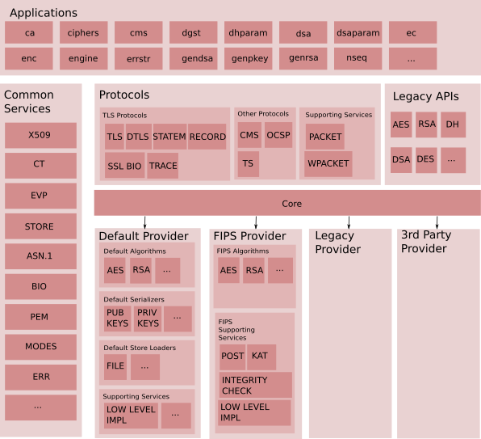

The new components (not present in the previous architecture) shown
here are as follows:

*   Core: This is a fundamental component that connects requests for
    an operation (such as encryption) to a provider of that
    operation. It provides the ability to locate an implementation of
    an algorithm offering specified operations given a set of
    properties that the implementation must fulfil. For example,
    properties of an encryption algorithm may include at a minimum
    "fips".
*   Default Provider: Implements a set of default algorithms.
*   FIPS Provider: Implements a set of algorithms that are FIPS
    validated and are made available via the Core. This includes the
    following supporting services:
    *   POST: Power On Self Test
    *   KAT: Known Answer Tests
    *   Integrity Check
    *   Low Level Implementations: This is the set of components that
        actually implement the cryptographic primitives (to meet the
        FIPS-mandated self-contained requirement).
*   Engines Provider: A shim that allows existing engines to work
    when called via the Core.
*   Legacy Provider: Provides implementations of older algorithms that
    will be exposed via EVP-level APIs.
*   3rd Party Providers: Eventually, third-parties may provide their
    own providers. A third-party provider, like any other provider,
    implements a set of algorithms that will be accessible to
    applications and other providers via the Core.

### Packaging View {#package-view}

The various components described in the conceptual component view
above are physically packaged into:

*   Executable application(s) for use by users
*   Libraries for use by application(s)
*   Dynamically loadable module(s) for use by the Core.

There will be multiple different packaging options provided with
OpenSSL 3.0 (for example a single library libcrypto containing
everything except the FIPS Provider, and all providers as separate
dynamically loadable modules).

Which dynamically loadable modules are registered, used, or available
will be able to be configured at runtime.

The following figure describes the architecture in terms of physical
packages.

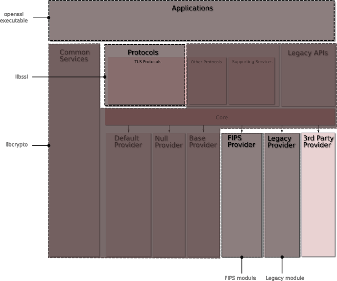

The physical packages new to this release are:

*   FIPS module. This contains the FIPS Provider that implements a set
    of algorithms that are FIPS validated and are available via the
    Core. The FIPS Provider is the OpenSSL FIPS Cryptographic Module
    3.0.

    We will not attempt to preclude users from making errors, however
    we will keep in mind the typical user usage and "safety". By
    default the FIPS provider will be built and installed.

    We will be able to perform a safety check that detects if the user
    has modified the source in a FIPS-impactful manner from the
    release distribution and block building the FIPS provider (on best
    effort basis) unless an override option is provided.

    We need to ensure there is a mechanism that enables the end user
    to determine whether or not their usage of the FIPS module is
    within the allowed uses under a formal validation.

    Versioning of the FIPS module will be aligned with the base
    OpenSSL version  number at the point in time of the
    validation. Not all OpenSSL releases will need an update to the
    FIPS module. Therefore when a new FIPS module version is released
    there may be gaps/jumps in its version number since the previous
    release.

*   Legacy module. This contains implementations of legacy
    algorithms.

Engines will be built with a provider shim, to allow them to work as
usual for cases when an ENGINE pointer is passed to some functions,
and as providers when acting as default implementations. Engines
compiled for pre-3.0.0 OpenSSL will need to be recompiled to work with
OpenSSL 3.0.0. Details in
[The ENGINE API](#the-engine-api) further down.

## Core and Provider Design {#core-and-provider-design}

The interactions relevant for the Core and provider design are shown
in the diagram below. There are four major components: User
Application, EVP component, the Core, and a cryptographic
Provider. (There may be multiple providers, but that is not relevant
here).


The Core has the following characteristics:

*   It enables Provider discovery, loading, initialisation and
    unloading
*   It enables property-based algorithm queries
*   It implements caching of algorithm queries and implementation
    details
*   It operates within a library context that contains data such as
    global properties, search cache and dispatch tables.

Providers have the following characteristics:

*   They provide for access to specific algorithm implementations
*   They associate algorithm implementations with a set of well
    defined properties
*   They support parameter passing in an implementation agnostic
    manner
*   They can be loaded at any point in time
*   They have a well-known module entry point

The subsections that follow describe the flow an application uses to
load a provider, fetch an algorithm implementation, and use it.  In
addition, this section describes in detail how algorithms, properties,
and parameters are named; how algorithm queries are handled; how
algorithms are registered and initialized; and how providers are
loaded.

In order for an application to be able to use an algorithm it must
first "fetch" an implementation of it through an algorithm query. Our
design objective is to be able to support both explicit (up front)
fetching of algorithms and fetching of algorithms on use. By default
we expect to do fetching on use (e.g. using `EVP_sha256()`) so that
algorithms are typically fetched during an "init" function and bound
to a context  object (often named `ctx`). The explicit fetching option
will be implemented via new API calls (e.g. `EVP_MD_fetch()`).

The diagram above shows the explicit fetch approach. The steps are as
follows:


1.  Every provider needs to be loaded. This will happen implicitly
    (default provider or specified via configuration) and may also be
    explicitly requested by the application. Load encompases both
    dynamic shared object loading (as needed) and initialisation.
    1.  The Core physically loads the module into memory (not required
        if default provider is already in memory).
    2.  The Core calls the provider's entry point for the provider to
        initialise itself.
        1.  Within the entry point function, the provider initialises
            some provider variables using values passed in from the
            Core. A provider algorithm implementation query callback
            is returned to the Core if initialization succeeds.
2.  User application requests algorithm by calling a fetch routine.
    1.  The search by EVP will combine global properties with
        call-specific ones and an algorithm identity to find the
        corresponding algorithm implementation, and then create and
        return a library handle (e.g. `EVP_MD`, `EVP_CIPHER`) to the
        application.
        1.  The first search of the implementation dispatch table is
            made in an internal cache.
        2.  Should the first search fail, a second search is made by
            asking the providers if they have an implementation of
            said algorithm with the queried properties. When this
            search is done, the resulting data is cached unless the
            provider opts out of caching, to be used in the first
            search (2.1.1). For example a PKCS#11 provider may opt out
            of caching because its algorithms may become available and
            unavailable over time.
3.  The user application then uses the algorithm via EVP APIs (e.g.,
    `EVP_DigestInit()`, `EVP_DigestUpdate()`, `EVP_DigestFinal()`,
    etc).
    1.  The function pointer is invoked and ends up in the provider
        for the implementation to perform the requested cryptographic
        algorithm.

For the existing `EVP_{algorithm}()` functions (e.g. `EVP_sha256()`,
etc) things remain mostly unchanged. In particular, the fetch call is
not performed when the `EVP_{algorithm}()` call returns, but rather it
happens implicitly when the context object (e.g. `EVP_MD_CTX`) is
bound within the respective EVP init function. Specifically, step 2.1
happens just before step 3.1. This is known as "implicit
fetch". Implicit fetch always operates within a default library
context (see [Library Context](#library-context) below).

The method dispatch table is a list of `<function-id,
function-pointer>` pairs — where the `function-id`s are publically
defined and known by OpenSSL — put together with a set of properties
that can be used to identify each particular implementation.  The Core
can take a property query and find the corresponding dispatch table,
to be used for applicable operations. This approach allows providers
to flexibly pass references to functions that the OpenSSL code can use
to create its method structures dynamically.

Providers can be loaded at any point in time. Unload at any point in
time can be requested.  It is up to the application to ensure that a
provider is not currently being used or referenced when it is
unloaded. If an attempt is made to use an implementation that is no
longer available then an error will be returned.

The assumptions an application can currently make about the return
from `EVP_{algorithm}()` and not the new fetch approach are:

*   const pointer
*   does not need to be freed by the application
*   can safely be compared for checking algorithms are the same
    (i.e. specifically comparing pointers to `EVP_CIPHER`, `EVP_MD`,
    etc)

For a direct use of explicit fetch by the application (rather than
using the existing `EVP_{algorithm}()` functions) the semantics will
be different:

*   non-const pointer
*   needs to be freed by the application
*   pointers can't be safely compared with each other (more on that in
    the next paragraph)

There will be new APIs to test the equality of objects that can be
used for both explicitly fetched objects and static variant ones
These APIs will enable comparison of just the algorithm identity,
or of specific algorithm implementations.

### Library Context {#library-context}

A library context is an opaque structure that holds library "global"
data.  OpenSSL will provide such a structure, limited to the global
data that the Core has to keep. Future expansion may come to include
other existing global data. An application will be able to create and
destroy one or more library context(s) within which all subsequent
interactions with the Core operate within. If the application does not
create and provide its own library context, an internal default one
will be used.


``` C
OPENSSL_CTX *OPENSSL_CTX_new();
void OPENSSL_CTX_free(OPENSSL_CTX *ctx);
```

A library context can be passed to the explicit fetch functions.  If
`NULL` is passed to them, the internal default context will be used.

More than one library context may be allocated, which implies that any
provider module may be initialized more than once.  This permits an
application to both be directly linked with libcrypto and loading
providers it's interested in, as well as being linked with other
libraries that use their own provider modules, independently.

### Naming {#naming}

Names are required for algorithms, parameters, and properties. In
order to ensure consistency and to enable external Provider
implementers to define new names in a consistent way there will be a
registry of recommended or used names. It will be maintained
separately from the sources.

The ability to define aliases for names is required because there are
contexts where there are more than one name for the same thing
(e.g. EC curves with general names and NIST names for the same
thing).

### Properties for Algorithm Implementation Selection {#properties-for-algorithm-implementation-selection}

Algorithm implementations (cryptographic and non-cryptographic) will
have some properties which will be used to select an implementation
from amongst those available. For 3.0, two properties are defined:

*   _is this implementation the default implementation?_
*   _is this implementation FIPS validated_?

The valid input and their meaning are:

+---------------------+-----------------------------+------------------------+
| **Property String** | **Meaning in a definition** | **Meaning in a query** |
+=====================+=============================+========================+
| `default`           | This is the default         | Request the default    |
|                     | implementation              | implementation         |
+---------------------+-----------------------------+------------------------+
| `default=yes`       | This is the default         | Request the default    |
|                     | implementation              | implementation         |
+---------------------+-----------------------------+------------------------+
| `default=no`        | This is not the default     | Request a non-default  |
|                     | implementation              | implementation         |
+---------------------+-----------------------------+------------------------+
| `fips`              | This implementation is FIPS | Request an             |
|                     | validated.                  | implementation that is |
|                     |                             | FIPS validated         |
+---------------------+-----------------------------+------------------------+
| `fips=yes`          | This implementation is FIPS | Request an             |
|                     | validated.                  | implementation that is |
|                     |                             | FIPS validated         |
+---------------------+-----------------------------+------------------------+
| `fips=no`           | This implementation is not  | Request an             |
|                     | FIPS validated.             | implementation that is |
|                     |                             | not FIPS validated     |
|                     |                             |                        |
+---------------------+-----------------------------+------------------------+

In all cases property names will be defined as printable ASCII
characters and are case insensitive. Property values may be quoted or
unquoted. Unquoted values will also always be printable ASCII
characters and are case insensitive. Quoted values are tested for
equality on a raw byte comparison basis only.

Providers will be able to provide their own names or values. The full
syntax of property definitions and queries appear in
[Appendix 1 - Property Syntax](#appendix-1---property-syntax).

OpenSSL reserves all property names that do not have a period;
vendor-provided property names must have a period in the name. It is
expected (but not enforced) that the part of the property name before
the first period is or relates to the provider's name, to provide some
level of conflict avoidance via namespacing.

It is likely that additional properties will be defined during the
development of this release.  A likely candidate is `provider` being
the name of the provider that is supplying the implementation.
Another possibility is `engine`, meaning that this algorithm is
implemented by an OpenSSL 1.1.1 dynamically loaded engine masquerading
as a provider.

There will be a built in global property query string, which will be
"default".

#### Property-based Algorithm Selection {#property-based-algorithmselection}

Algorithm implementation selection is based on properties.

The provider sets properties on the algorithms it offers. The
application sets which properties that it wants to see used as a
filter during algorithm selection - the query.

The desired properties for fetching algorithm implementations can be
specified in the following places:

1.  globally, based on configuration files.
2.  globally, based on API calls.
3.  on a per-object basis for specific objects. E.g. SSL_CTX, SSL.

Properties will be used during algorithm lookup (parameter
specification of property values).

The sets of properties will be evaluated in a manner that resolves to
a single value of a property for each specified property
(keyword). The precedence order for keyword evaluation is:


1.  The per-object or directly specified API parameter to fetch
1.  The global (default) properties set by API calls
1.  The global (default) properties set in configuration files

It is possible that additional property setting methods and evaluation
approaches will be defined during the development of this release.

By default, OpenSSL 3.0 will load a configuration file (which contains
global properties and other settings) automatically without explicit
application API calls. This will occur in libcrypto. Note that in
OpenSSL 1.1.1 the configuration file is automatically loaded only by
the default (automatic) initialisation of libssl.

### Parameter Definition {#parameter-definition}

The OpenSSL Core and providers have to exchange data while keeping
OpenSSL and provider structures opaque.  All composite values will be
passed as an array of items, using the public data structure defined
in
[Appendix 2 - OpenSSL parameter passing](#appendix-2---parameter-passing).
Parameters will be identified using their name (as a string) and each
contains its own type and size information.

The Core will define an API to pass an array of parameter values or
requests for values to a provider or a specific algorithm
implementation, and for the latter, an associated object handled by
that implementation.  In the cases of the basic machine types, macros
could be developed to assist in the construction and extraction of
values.

### Operation and Operation Function Definitions {#operation-and-operation-function-definitions}

While algorithm and parameter names are essentially controlled and
allocated by the providers, the operations and associated functions
that are going to be called by libcrypto are essentially controlled
and allocated by the Core.

For things that are only controlled by the Core, we will use macros to
name them, with numbers as values to be used as indexes.  Allocation
will be incremental, i.e. for any new operation or function, the next
number available will be picked.

### Algorithm Query {#algorithm-query}

Each algorithm type (e.g. `EVP_MD`, `EVP_CIPHER` etc) with have a
"fetch" function available (e.g. `EVP_MD_fetch()`,
`EVP_CIPHER_fetch()`).  Algorithm implementations are identified using
their name and properties

Each fetch function will use services provided by the Core to find an
appropriate implementation as described in the introduction of
[Core and Provider Design](#core-and-provider-design). If an appropriate
implementation has been found then it is constructed into a suitable
algorithm structure (e.g. `EVP_MD`, `EVP_CIPHER`) and returned to the
calling application.

If multiple implementations are equally good matches for the passed
name and properties, one of these will be returned on retrieval but
exactly which one is not defined. Furthermore, there is no guarantee
that the same match would be returned every time.

### Algorithm Query Caching {#algorithm-query-caching}


Algorithm queries will be cached together with their result.

The algorithm query cache can be flushed to remove:

*   All queries returning a specific algorithm implementation
*   All algorithm implementations from a specific provider
*   All algorithm implementations

### Multilevel Queries {#multilevel-queries}

In order to handle both global properties and properties passed to
specific calls (such as fetch calls), the global property query
settings will be merged with the passed property settings except where
there is a conflict, specifically:


+--------------------+---------------------+---------------------+
| **Global Setting** | **Passed Settings** | **Resulting Query** |
+====================+=====================+=====================+
| `fips=yes`         | `fips=yes`          | `fips=yes`          |
+--------------------+---------------------+---------------------+
| `fips=yes`         | `fips=no`           | `fips=no`           |
+--------------------+---------------------+---------------------+
| `fips=yes`         | `-fips`             | *fips is not        |
|                    |                     | specified*          |
+--------------------+---------------------+---------------------+
| `fips=yes`         | *fips is not        | `fips=yes`          |
|                    | specified*          |                     |
+--------------------+---------------------+---------------------+
| `fips=no`          | `fips=yes`          | `fips=yes`          |
+--------------------+---------------------+---------------------+
| `fips=no`          | `fips=no`           | `fips=no`           |
+--------------------+---------------------+---------------------+
| `fips=no`          | `-fips`             | *fips is not        |
|                    |                     | specified*          |
+--------------------+---------------------+---------------------+
| `fips=no`          | *fips is not        | `fips=no`           |
|                    | specified*          |                     |
+--------------------+---------------------+---------------------+
| *fips is not       | `fips=yes`          | `fips=yes`          |
| specified*         |                     |                     |
+--------------------+---------------------+---------------------+
| *fips is not       | `fips=no`           | `fips=no`           |
| specified*         |                     |                     |
+--------------------+---------------------+---------------------+
| *fips is not       | `-fips`             | *fips stays not     |
| specified*         |                     | specified*          |
+--------------------+---------------------+---------------------+
| *fips is not       | *fips is not        | *fips stays not     |
| specified*         | specified*          | specified*          |
+--------------------+---------------------+---------------------+


### Provider Module Loading {#provider-module-loading}


Providers can either be built-in or dynamically loadable modules.

All algorithms are implemented by providers. The OpenSSL Core will
initially have no providers loaded, and therefore will have no
algorithms available. Providers will need to be discovered and
loaded. The algorithm implementations contained within them can then
be queried by the Core at a later time, with those queries possibly
becoming cached.

If no provider has been loaded at the time of the first fetch
(implicit as well as explicit), the built in default provider will be
automatically loaded.

Note that a provider may be written against an older version of the
Core API than the current version in libcrypto. For example, it will
have to be possible for users to run a different FIPS provider module
version than the main OpenSSL version. This means the Core API will
have to remain stable and backwards compatible (just like any other
public API).

All of the command line applications supplied as part of the OpenSSL
build will gain a `-provider xxx` option which loads a provider.  This
option can be specified multiple times on the command line (as
multiple providers can always be loaded) and it isn't an error if the
provider remains unused for any specific operation (e.g. loading a
provider that only supplies AES when doing a SHA256 digest).

#### Finding and loading dynamic provider modules {#finding-and-loading-dynamic-provider-modules}

Dynamic provider modules are `.so` files on UNIX type operating
systems, or a `.dll` file on Windows type operating systems, or
whatever corresponds on other operating systems.  By default, they
will be installed in a well known directory.

Provider module loading can occur several ways:

*   **On demand**, the application will have to specify exactly what
    provider modules should be loaded.
*   **By configuration**, the set of provider modules to load would be
    specified in a configuration file.

Some of these methods may be combined.

A provider module can be specified by full path, and can therefore be
loaded even if it isn't located in the well known directory.

After the Core loads a  provider module, it calls the provider module
entry point.

#### Provider Module Entry Point {#provider-module-entry-point}

A provider module _must_ have the following  well known entry point:

``` C
int OSSL_provider_init(const OSSL_PROVIDER *provider,
                       const OSSL_DISPATCH *in,
                       const OSSL_DISPATCH **out
                       void **provider_ctx);
```

If the entry point does not exist in the dynamically loaded object,
then it is not a valid module and loading it will fail.

`in` is an array of functions that the Core passes to the provider.

`out` is an array of provider functions that the provider passes back
to the Core.

`provider_ctx` (may be shortened to `provctx` elsewhere in this
document) is an object optionally created by the provider for its own
use (storing data it needs to keep around safely).  This pointer will
be passed back to appropriate provider functions.

`provider` is a handle to a provider object belonging to the Core.
This can serve as a unique provider identity which may be required in
some API calls.  This object will also be populated with diverse data,
such as module path, NCONF configuration structure for the provider
(see [CONF / NCONF values as parameters](#conf-nconf-values-as-parameters)
below for an idea on how that would be implemented), and these diverse
values can then be retrieved by the provider using a params getter
callback that the Core provides.  The type `OSSL_PROVIDER` is opaque.

`OSSL_DISPATCH` is an open structure that implements the `< function-id,
function-pointer >` tuple mentioned in the introduction of
[Core and Provider Design](#core-and-provider-design):


``` C
typedef struct ossl_dispatch_st {
    int function_id;
    void *(*function)();
} OSSL_DISPATCH;
```


The `funcion_id` identifies a specific function, and `function` is the
pointer to that function. An array of these is terminated with
`function_id` set to zero.

The provider module may or may not be linked against libcrypto. If it
is not then it will have no direct access to any libcrypto
functions. All essential communication back to libcrypto will be via
callback functions provided by the Core. It is important that memory
allocated by specific providers is freed by the same
providers. Similarly memory allocated in libcrypto should be freed by
libcrypto.

The API will specify a well known set of callback function
numbers. More function numbers can be added in later releases as
required without breaking backwards compatibility.


``` C
/* Functions provided by the Core to the provider */
#define OSSL_FUNC_ERR_PUT_ERROR                        1
#define OSSL_FUNC_GET_PARAMS                           2
/* Functions provided by the provider to the Core */
#define OSSL_FUNC_PROVIDER_QUERY_OPERATION             3
#define OSSL_FUNC_PROVIDER_TEARDOWN                    4
```


The Core will set up an array of the well known callback functions:


``` C
static OSSL_DISPATCH core_callbacks[] = {
    { OSSL_FUNC_ERR_PUT_ERROR, ERR_put_error },
    /* int ossl_get_params(OSSL_PROVIDER *prov, OSSL_PARAM params[]); */
    { OSSL_FUNC_GET_PARAMS, ossl_get_params, }
    /* ... and more */
};
```

This is only a few of the functions that the Core may see fit to pass
to a provider.  We may also pass functions to help with logging,
testing, instrumentation etc as the need comes up.

Once the module is loaded and the well known entry point located, the
init entry point can be invoked by the Core:

``` C
/*
 * NOTE: this code is meant as a simple demonstration of what could happen
 * in the core.  This is an area where the OSSL_PROVIDER type is not opaque.
 */
OSSL_PROVIDER *provider = OSSL_PROVIDER_new();
const OSSL_DISPATCH *provider_callbacks;
/*
 * The following are diverse parameters that the provider can get the values
 * of with ossl_get_params.
 */
/* reference to the loaded module, or NULL if built in */
provider->module = dso;
/* reference to the path of the loaded module */
provider->module_path = dso_path;
/* reference to the NCONF structure used for this provider */
provider->conf_module = conf_module;

if (!OSSL_provider_init(provider, core_callbacks, &provider_callbacks))
    goto err;

/* populate |provider| with functions passed by the provider */
while (provider_callbacks->func_num > 0) {
    switch (provider_callbacks->func_num) {
    case OSSL_FUNC_PROVIDER_QUERY_OPERATION:
        provider->query_operation = provider_callbacks->func;
        break;
    case OSSL_FUNC_PROVIDER_TEARDOWN:
        provider->teardown = provider_callbacks->func;
        break;
    }
    provider_callbacks++;
}
```


The `OSSL_provider_init` entry point does not register any algorithms
that will be needed, but it will return at least these two callbacks
to enable this process:

1.  `OSSL_FUNC_QUERY_OPERATION`, which is used to find out what
    implementations of an operation are available.  This must return
    an array of `OSSL_ALGORITHM` (see further down), which maps
    algorithm names and property definition strings to implementation
    dispatch tables.  This function must also be able to indicate if
    the resulting array may be cached by the Core or not. This is
    explained in further detail below.
2.  `OSSL_FUNC_TEARDOWN`, which is used when the provider is unloaded.

The provider register callback can only be run after the
`OSSL_provider_init()` call succeeds.

#### Provider Initialisation and Algorithm Registration {#provider-initialisation-and-algorithm-registration}


An algorithm offers a set of operations (capabilities, features,
etc). The operations are invoked via functions. For example, the RSA
algorithm offers signing and encryption (two operations) which are
invoked via the _init_, _update_, _final_ functions for signing and
_init_, _update_, _final _ functions for encryption. The set of
functions is determined by the implementation of the upper-level EVP
code.

Operations are identified by a unique number. For example:


``` C
#define OSSL_OP_DIGEST                     1
#define OSSL_OP_SYM_ENCRYPT                2
#define OSSL_OP_SEAL                       3
#define OSSL_OP_DIGEST_SIGN                4
#define OSSL_OP_SIGN                       5
#define OSSL_OP_ASYM_KEYGEN                6
#define OSSL_OP_ASYM_PARAMGEN              7
#define OSSL_OP_ASYM_ENCRYPT               8
#define OSSL_OP_ASYM_SIGN                  9
#define OSSL_OP_ASYM_DERIVE               10
```

For a provider to make an algorithm usable by libcrypto, it must
register an operation querying callback, which returns an array of
implementation descriptors, given an operation identity:


    < algorithm name, property definition string, implementation `OSSL_DISPATCH*` >

So for example, this query callback will return the list of all its
digests if the given operation is `OSSL_OP_DIGEST`.

Algorithms are identified by a string.

The Core provides a set of services for the provider to use in the
form of a function table.

A provider will also offer a service for returning information (in the
form of parameters as specified in
[Appendix 2 - Parameter Passing](#appendix-2---parameter-passing)) via
a callback provided by the provider, such as:


*   version number
*   Build strings - as per the current OpenSSL related build
    information (only at the provider level)
*   Provider name


An individual operation may require multiple function callbacks to be
defined in order to implement the operation. Each function will be
identified by a numeric function identity. Each of the identities are
unique for the combination of operation and function, i.e. the number
assigned to the init function of the digest operation cannot be reused
for init functions for other operations, those will have their own
unique numbers. For example, for the digest operation, these functions
are required:

``` C
#define OSSL_OP_DIGEST_NEWCTX_FUNC         1
#define OSSL_OP_DIGEST_INIT_FUNC           2
#define OSSL_OP_DIGEST_UPDATE_FUNC         3
#define OSSL_OP_DIGEST_FINAL_FUNC          4
#define OSSL_OP_DIGEST_FREECTX_FUNC        5
typedef void *(*OSSL_OP_digest_newctx_fn)(void *provctx);
typedef int (*OSSL_OP_digest_init_fn)(void *ctx);
typedef int (*OSSL_OP_digest_update_fn)(void *ctx, void *data, size_t len);
typedef int (*OSSL_OP_digest_final_fn)(void *ctx, void *md, size_t mdsize,
                                       size_t *outlen);
typedef void (*OSSL_OP_digest_freectx_fn)(void *ctx);
```

An all in one version is also advisable for devices that cannot handle
multi-part operations:

``` C
#define OSSL_OP_DIGEST_FUNC                6
typedef int (*OSSL_OP_digest)(void *provctx,
                              const void *data, size_t len,
                              unsigned char *md, size_t mdsize,
                              size_t *outlen);
```


A provider then defines arrays containing the set of functions for
each algorithm implementation and one array of algorithm descriptors
for each operation.  The algorithm descriptor was mentioned higher up,
and would be publically defined like this:


``` C
typedef struct ossl_algorithm_st {
    const char *name;
    const char *properties;
    OSSL_DISPATCH *impl;
} OSSL_ALGORITHM;
```

For example (and it is only an example, providers may arrange these
things any way they want, the important thing is what the algorithm
querying function such as `fips_query_operation` below returns) the
FIPS module may define arrays like this for the SHA1 algorithm:


``` C
static OSSL_DISPATCH fips_sha1_callbacks[] = {
    { OSSL_OP_DIGEST_NEWCTX_FUNC, fips_sha1_newctx },
    { OSSL_OP_DIGEST_INIT_FUNC, fips_sha1_init },
    { OSSL_OP_DIGEST_UPDATE_FUNC, fips_sha1_update },
    { OSSL_OP_DIGEST_FINAL_FUNC, fips_sha1_final },
    { OSSL_OP_DIGEST_FUNC, fips_sha1_digest },
    { OSSL_OP_DIGEST_FREECTX_FUNC, fips_sha1_freectx },
    { 0, NULL }
};
static const char prop_fips[] = "fips";
static const OSSL_ALGORITHM fips_digests[] = {
    { "sha1", prop_fips, fips_sha1_callbacks },
    { "SHA-1", prop_fips, fips_sha1_callbacks }, /* alias for "sha1" */
    { NULL, NULL, NULL }
};
```

The FIPS provider init module entry point function might look like
this:

``` C
static int fips_query_operation(void *provctx, int op_id,
                                const OSSL_ALGORITHM **map)
{
    *map = NULL;
    switch (op_id) {
    case OSSL_OP_DIGEST:
        *map = fips_digests;
        break;
    }
    return *map != NULL;
}

#define param_set_string(o,s) do {                                  \
    (o)->buffer = (s);                                              \
    (o)->data_type = OSSL_PARAM_UTF8_STRING_PTR;                    \
    if ((o)->result_size != NULL) *(o)->result_size = sizeof(s);    \
} while(0)
static int fips_get_params(void *provctx, OSSL_PARAM *outparams)
{
    while (outparams->key != NULL) {
        if (strcmp(outparams->key, "provider.name") == 0) {
            param_set_string(outparams, "OPENSSL_FIPS");
        } else if if (strcmp(outparams->key, "provider.build") == 0) {
            param_set_string(outparams, OSSL_FIPS_PROV_BUILD_STRING);
        }
    }
    return 1;
}

OSSL_DISPATCH provider_dispatch[] = {
    { OSSL_FUNC_PROVIDER_QUERY_OPERATION, fips_query_operation },
    { OSSL_FUNC_PROVIDER_GET_PARAMS, fips_get_params },
    { OSSL_FUNC_PROVIDER_STATUS, fips_get_status },
    { OSSL_FUNC_PROVIDER_TEARDOWN, fips_teardown },
    { 0, NULL }
};
static core_put_error_fn *core_put_error = NULL;
static core_get_params_fn *core_get_params = NULL;

int OSSL_provider_init(const OSSL_PROVIDER *provider,
                       const OSSL_DISPATCH *in,
                       const OSSL_DISPATCH **out
                       void **provider_ctx)
{
    int ret = 0;

    /*
     * Start with collecting the functions provided by the core
     * (we could write it more elegantly, but ...)
     */
    while (in->func_num > 0) {
        switch (in->func_num) {
        case OSSL_FUNC_ERR_PUT_ERROR:
            core_put_error = in->func;
            break;
        case OSSL_FUNC_GET_PARAMS:
            core_get_params = in->func;
            Break;
        }
        in++;
    }

    /* Get all parameters required for self tests */
    {
        /*
         * All these parameters come from a configuration saying this:
         *
         * [provider]
         * selftest_i = 4
         * selftest_path = "foo"
         * selftest_bool = true
         * selftest_name = "bar"
         */
        OSSL_PARAM selftest_params[] = {
            { "provider.selftest_i", OSSL_PARAM_NUMBER,
              &selftest_i, sizeof(selftest_i), NULL },
            { "provider.selftest_path", OSSL_PARAM_STRING,
              &selftest_path, sizeof(selftest_path), &selftest_path_ln },
            { "provider.selftest_bool", OSSL_PARAM_BOOLEAN,
              &selftest_bool, sizeof(selftest_bool), NULL },
            { "provider.selftest_name", OSSL_PARAM_STRING,
              &selftest_name, sizeof(selftest_name), &selftest_name_ln },
            { NULL, 0, NULL, 0, NULL }
        }
        core_get_params(provider, selftest_params);
    }

    /* Perform the FIPS self test - only return params if it succeeds. */
    if (OSSL_FIPS_self_test()) {
        *out = provider_dispatch;
        return 1;
    }
    return 0;
}
```

### Algorithm Selection {#algorithm-selection}


Multiple providers may be available at any one time. Existing
application code re-compiled for this version should continue to
work. At the same time it should be possible with minor code
adjustments to be able to find and use algorithms using the new
property based algorithm lookup capability.

To illustrate how this might work, the code below is an example of how
a simple AES-CBC-128 encryption might be done using OpenSSL 1.1.1. All
error handling has been stripped out for simplicity.

``` C
EVP_CIPHER_CTX *ctx;
EVP_CIPHER *ciph;

ctx = EVP_CIPHER_CTX_new();
ciph = EVP_aes_128_cbc();
EVP_EncryptInit_ex(ctx, ciph, NULL, key, iv);
EVP_EncryptUpdate(ctx, ciphertext, &clen, plaintext, plen);
EVP_EncryptFinal_ex(ctx, ciphertext + clen, &clentmp);
clen += clentmp;

EVP_CIPHER_CTX_free(ctx);
```

In OpenSSL 3.0, such code would continue to work and would use
algorithms from a provider (assuming nothing else has been configured,
it will be the default provider). It could also be rewritten using
explicit fetching as follows. Explicit fetching also enables the
application to specify a non-default library context if required
(`osslctx` in this example):


``` C
EVP_CIPHER_CTX *ctx;
EVP_CIPHER *ciph;

ctx = EVP_CIPHER_CTX_new();
ciph = EVP_CIPHER_fetch(osslctx, "aes-128-cbc", NULL);                /* <=== */
EVP_EncryptInit_ex(ctx, ciph, NULL, key, iv);
EVP_EncryptUpdate(ctx, ciphertext, &clen, plaintext, plen);
EVP_EncryptFinal_ex(ctx, ciphertext + clen, &clentmp);
clen += clentmp;

EVP_CIPHER_CTX_free(ctx);
EVP_CIPHER_free(ciph);                                                /* <=== */
```


An application may wish to use algorithms from a different provider.

For example, consider the scenario where an application wishes to use
some algorithms from the FIPS provider, but still use the default
algorithms in certain cases. This could be implemented in different
ways, e.g.


1.  Only use FIPS algorithms.
2.  Default to using FIPS algorithms. Be able to override it on an "as
    needed" basis to get access to a non FIPS algorithm.
3.  Default to not caring about FIPS algorithms. Be able to override
    it on an "as needed" basis to get a FIPS algorithm.

#### Only FIPS {#only-fips}

Compared to code written for pre-3.0.0 OpenSSL, all you need to do to
only get FIPS implementations is something like this:

``` C
int main(void)
{
    EVP_set_default_alg_properties(NULL, "fips=yes");                 /* <=== */
    ...
}
```

Then the above encryption code that uses `EVP_aes_128_cbc() `would
continue to work as before. The `EVP_EncryptInit_ex()` call would use
those default algorithm properties, and then look it up via the Core
in order to get a handle to the FIPS implementation. This
implementation would then be associated with the `EVP_CIPHER_CTX`
object. If there isn't a suitable algorithm implementation available
then the the `EVP_Encrypt_init_ex()` call will fail.

The first parameter to `EVP_set_default_alg_properties` is the library
context, NULL being the default internal one.

#### Default to FIPS but allow an override {#default-to-fips-but-allow-an-override}

To default to using FIPS algorithms but override it on an _as needed_
basis to non-FIPS algorithms, the application might instead do this,
compared to code written for pre-3.0.0 OpenSSL:

``` C
int main(void)
{
    EVP_set_default_alg_properties(osslctx, "fips=yes");              /* <=== */
    ...
}

EVP_CIPHER_CTX *ctx;
EVP_CIPHER *ciph;

ctx = EVP_CIPHER_CTX_new();
ciph = EVP_CIPHER_fetch(osslctx, "aes-128-cbc", "fips!=yes");         /* <=== */
EVP_EncryptInit_ex(ctx, ciph, NULL, key, iv);
EVP_EncryptUpdate(ctx, ciphertext, &clen, plaintext, plen);
EVP_EncryptFinal_ex(ctx, ciphertext + clen, &clentmp);
clen += clentmp;

EVP_CIPHER_CTX_free(ctx);
EVP_CIPHER_free(ciph);                                                /* <=== */
```

Here the `EVP_CIPHER_fetch()` call would combine properties from:

1.  The default algorithm properties
2.  The properties passed in as a parameter (with the passed in
    properties taking precedence).

Because the `EVP_CIPHER_fetch()` call overrides the default "fips"
property it will look for an implementation of AES-CBC-128 that is not
"fips".

In this example, we see a non-default library context being used.
This is only possible with explicitly fetched implementations.

(note for the attentive: `"fips!=yes"` could as well be `"fips=no"`,
but is provided here as an example of the "not equal to" operator)

#### Default to not caring and allow override for FIPS {#default-to-not-caring-and-allow-override-for-fips}

To default to not using FIPS algorithms but override it on an _as
needed_ basis to use FIPS, the application code might look like this,
compared to code written for pre-3.0.0 OpenSSL:

``` C
EVP_CIPHER_CTX *ctx;
EVP_CIPHER *ciph;

ctx = EVP_CIPHER_CTX_new();
ciph = EVP_CIPHER_fetch(osslctx, "aes-128-cbc", "fips=yes");          /* <=== */
EVP_EncryptInit_ex(ctx, ciph, NULL, key, iv);
EVP_EncryptUpdate(ctx, ciphertext, &clen, plaintext, plen);
EVP_EncryptFinal_ex(ctx, ciphertext + clen, &clentmp);
clen += clentmp;

EVP_CIPHER_CTX_free(ctx);
EVP_CIPHER_free(ciph);                                                /* <=== */
```

In this version we have not overridden the default algorithm
properties in "main", and therefore you get the standard
out-of-the-box defaults which are to not mandate the use of
FIPS. However we've explicitly set the "fips" property at the
`EVP_CIPHER_fetch()` level, and so that overrides the default. When
`EVP_CIPHER_fetch()` looks up the algorithm using the Core it will get
a reference to the FIPS one (or fail if no such algorithm is
available).

#### Asymmetric algorithm selection {#asymmetric-algorithm-selection}

Note that for symmetric encryption/decryption and for message digests
there are existing OpenSSL objects that can be used to represent an
algorithm, i.e. `EVP_CIPHER` and `EVP_MD`. For asymmetric algorithms
there is no equivalent object. The algorithm in use is inferred
implicitly from the type of the `EVP_PKEY`.

In order to solve this problem a new asymmetric algorithm object will
be introduced. In the example below an ECDH key derivation is
performed. We lookup a FIPS ECDH implementation (assuming we _know_
that the given private key is an ECC one, of course) using a new
algorithm object, `EVP_ASYM`:

``` C
EVP_PKEY_CTX *pctx = EVP_PKEY_CTX_new(privkey, NULL);
EVP_ASYM *asym = EVP_ASYM_fetch(osslctx, EVP_PKEY_EC, "fips=yes");
EVP_PKEY_CTX_set_alg(pctx, asym));
EVP_PKEY_derive_init(pctx);
EVP_PKEY_derive_set_peer(pctx, pubkey);
EVP_PKEY_derive(pctx, out, &outlen);
EVP_PKEY_CTX_free(pctx);
```

### Example dynamic views of algorithm selection {#example-dynamic-views-of-algorithm-selection}

The sequence diagram below shows an example of how the SHA256
algorithm might be selected and invoked from the default provider.

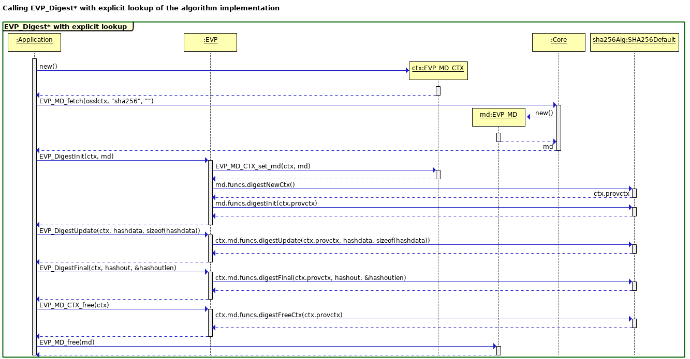

Note that each EVP layer call is implemented by thin wrappers in the
EVP layer, which invoke similarly named functions within the provider
on an algorithm by algorithm basis. The specific provider functions to
be used will be looked up in the Core Dispatcher tables via an
explicit `EVP_MD_fetch()` call that specifies the message digest name as a
string and any other relevant properties. The returned "md" object contains
function pointers to the implementation of the algorithm in the selected
provider.

The `EVP_MD_CTX` object is not passed through to the provider since we
do not know whether any specific provider module is linked against
libcrypto. Instead we simply pass through a black box handle (`void *`
pointer), which the provider will associate with whatever structure it
requires. This is allocated during an explicit `digestNewCtx()` call
to the provider at the beginning of the operation, and freed at the
end with a `digestFreeCtx()` call.

The next diagram shows a slightly more complex scenario, i.e. an
`EVP_DigestSign*` operation using RSA and SHA256. This diagram is
drawn from the perspective of libcrypto with algorithms being provided
by the FIPS module. A later section will examine this scenario from
the perspective of the FIPS module.


An `EVP_DigestSign*` operation is more complicated because it involves
two algorithms: a signing algorithm, and a digest algorithm. In
general those two algorithms may come from different providers or the
same one. In the case of the FIPS module the algorithms must both come
from the same FIPS module provider. The operation will fail if an
attempt is made to do otherwise.

In spite of the added complexity of having two algorithms the same
concepts apply as for the simpler `EVP_Digest*` operation shown in the
earlier diagram. There are two contexts produced: an `EVP_MD_CTX` and
an `EVP_PKEY_CTX`. Neither of these are passed through to the
provider. Instead black box (`void *`) handles are created via
explicit "newCtx" provider calls, and then those handles are passed
through during subsequent "init", "update" and "final" operations.

The algorithms are looked up in the Core dispatch tables using
explicit `EVP_MD_fetch()` and `EVP_ASYM_fetch()` calls in advance.

## FIPS Module {#fips-module}

This is a
[FIPS 140-2](https://csrc.nist.gov/publications/detail/fips/140/2/final)
validated cryptographic module. It is a
[provider](#core-and-provider-design) that contains FIPS
validated/approved cryptographic algorithms only. Non FIPS algorithms
will be supplied by the default provider  (not the FIPS module).

The module is dynamically loadable - static linking is not supported.

The FIPS Module will itself not have a "FIPS mode". The OpenSSL that
can use the FIPS provider will have a "mode" concept that is
compatible with the FIPS Module 2.0.0.

### FIPS Module Version Numbering {#fips-module-version-numbering}


The version will be FIPS module 3.0

Any subsequent revisions will be labelled in a similar manner to
previous releases i.e 3.0.x.

For change letters or revalidations the version number of the FIPS
Module will be updated to match the current version of the OpenSSL
library.

### Detection of Changes inside the FIPS Boundary {#detection-of-changes-inside-the-fips-boundary}

For the sake of validation, we need to detect if any relevant source
has changed.

This can be done with a script that tokenizes the C sources the same
way a C preprocessor does, but that is also taught to ignore certain
parts of the source:


*   System `#include` directives.
*   Code that is conditioned away in FIPS mode (as described in
    [Conditional Code](#conditional-code) below).

(reminder: a C preprocessor can, but doesn't not have to, collapse all
non-newline whitespace and leave a standard single space between every
token, and comments are considered to be whitespace for this purpose)

The result of the tokenization process can then go through a checksum,
which is stored in a file parallel to the source file and ultimately
version controlled.

The process will be something like this (not exactly, this is a code
example to show the overall process):

``` shell
    for f in $(FIPS_SOURCES); do
        perl ./util/fips-tokenize $f | openssl sha256 -r
    done | openssl sha256 -hex -out fips.checksum
```

There will also be some mechanism that alerts us of changes so we can take appropriate action.  For example:


``` shell
    git diff --quiet fips.checksum || \
        (git rev-parse HEAD > fips.commit; scream)
```


What `scream` should actually do is still to be determined.

Updating `fips.checksum` should happen as part of a normal `make
update`, which is the usual method to change and check changes on
files that are version controlled.  OpenSSL's CIs already run this to
see that nothing was forgotten, and breaks the build if something was
changed by this command.  Running `make update` is also part of the
normal OpenSSL release process.

#### How to react to a change of the signed checksum {#how-to-react-to-a-change-of-the-signed-checksum}


In spite of `scream`, a changed checksum in our repo isn't very
dramatic per se, it simply notifies us that we need to pay some extra
attention to the FIPS source.

Two possibilities:

1.  _When it's soon time for a release_ and `fips.checksum` no longer
    contains the checksum from the last validated source, send the
    FIPS source to the lab and get the update validation process
    started.
2.  _At the same time as a release is made_ `fips.checksum` no longer
    contains the checksum from the last validated source, send the
    FIPS source to the lab (including diff files and a change list)
    and get the appropriate update validation process started.

The list of validated checksums will be listed _somewhere else_ (to be
specified later)

#### Compiling {#compiling}

For each FIPS provider source file, we calculate that file's checksum
and check it against the collected checksum in `fips.checksum`, and
refuse to compile if there's a mismatch.

### FIPS Mode {#fips-mode}

The FIPS module only contains FIPS validated cryptographic
algorithms. Any FIPS mode 'switching logic' will be outside the FIPS
module boundary - this will be handled by the "fips" property.

[Conditional code](#conditional-code) related to FIPS mode is
discussed in a separate section.

The following FIPS API's will continue to be available for application
use (for consistency the same names present in 1.1.1 are used):

*   `int FIPS_mode_set(int on)`

    Ensures that "fips=yes" is set (for `on != 0`) or "fips" is unset
    (for `on == 0`) in the current global property setting. This will
    also attempt to fetch the `HMAC-SHA256` algorithm with the
    property "fips=yes" and ensure that it successfully returns.

*   `int FIPS_mode(void)`

    Returns 1 if the current global property string contains the
    property "fips=yes" (or "fips"), 0 otherwise.

    We could check if there is any provider available that offers a
    FIPS algorithm currently and handle this a little differently.

*   `int FIPS_self_test(void)`

    If the `FIPS_mode()` returns true then this runs the KATs.

    The integrity test will not be covered. That will be a separate
    function if we decide to provide it.

    Returns 1 on success; 0 on failure or there being no OpenSSL FIPS
    provider.

Note: these functions will only operate in the context of the OpenSSL
FIPS provider - not in the context of any other FIPS provider. These
are legacy, deprecated interfaces. The
`EVP_set_default_alg_properties()` function(s) should be used for
non-legacy configuration.

### Roles and Authentication {#roles-and-authentication}

There are two implied roles - Cryptographic Officer (CO) and
User. Both roles support all the same services. The only difference is
that the CO installs the software. The module should not support user
authentication (it is not required for level 1). This can all be
explained in the security policy without any specific code.

### Finite State Model (FIPS 140-2 section 4.4) {#finite-state-model}

A state machine needs to be defined.

We will require the following:

*   Self test states - initialisation, running, self test, error,
    shutdown, (and potentially post_triggered)
*   Error States - If a self test fails the module should return an
    error for that operation. It is permissible to try to clear the
    error and repeat the operation.  If failure persists, the module
    should enter an error state.  This can either be a hard error
    state where all cryptographic operations fail or a reduced
    functionality state where the failing components only return error
    when used.

    Failing a self test can be triggered by:

    1.  Continuous tests (key pair gen pairwise test (sign/verify) and
        random number compare test from entropy source to verify
        random number inputs into the DRBG are not the same).
    2.  DRBG health tests - this can be made to cause an error always
        just in the RNG (rather than setting a global error
        state)[^1].
    3.  POST Integrity test failure either at install, startup, or on
        demand.
    4.  POST KAT failure at startup, or on demand.

    An internal API will be supplied to set the failure state for the above cases.

#### State Machine {#state-machine}

States which are not present in the state machine are shown dotted.
The edges into and out of the error state are dashed  to indicate that
they are not expected to be traversed.

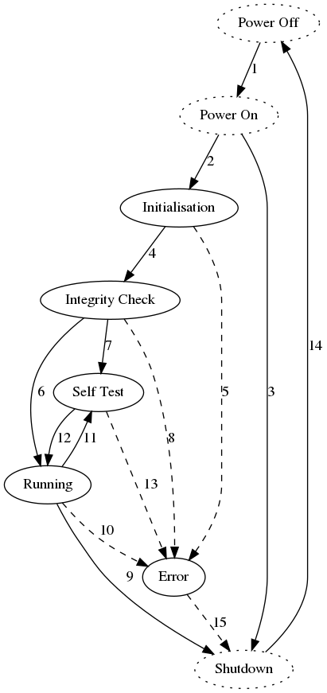{style="float: right"}

The state model consists of these states:

1.  **Power Off**: the FIPS module is not loaded into an application
    and the shared library is not in memory.
2.  **Power On**: the FIPS module has been loaded by an application
    and the shared library is in memory.  Default Entry Point
    Constructors will be initiated.
3.  **Initialisation**: `OSSL_provider_init` is called.
4.  **Integrity Check (POST Integrity)**: the module checksums itself
    and verifies that it hasn't been inadvertently altered.

    (This is run during the FIPS providers `OSSL_provider_init()`).

5.  **Self Test (POST KAT)**: the FIPS module is performing its POST
    during installation or the POST on demand from an API call.
6.  **Running**: the FIPS module is in its normal operating state.
    All APIs can be used and continuous testing is in force.
7.  **Error**: the FIPS module has entered an error state.  All
    cryptographic APIs will return an error when called.
8.  **Shutdown**: the FIPS module is being terminated and unloaded
    from the using application.

The edges between states are:

1.  **Power Off** to **Power On**: this transition is performed by the
    operating system when loading the shared library into an
    application.
2.  **Power On** to **Initialisation**: this transition occurs when
    the shared library constructor is called.
3.  **Power On** to **Shutdown**: this transition is triggered if the
    constructor cannot be called or if it fails.
4.  **Initialisation **to **Integrity Check**: this transition occurs
    when the initialisation code has completed.  The module integrity
    checksum is computed and compared to the expected value.
5.  **Initialisation **to **Error**: this transition is triggered if
    the initialisation code encounters an error before the self tests
    are initiated.
6.  **Integrity Check** to **Running**: this transition occurs for all
    startup where the integrity checks succeed after initial
    installation.
7.  **Integrity Check** to **Self Test**: this transition occurs
    during installation when the integrity checks succeed.
8.  **Integrity Check** to **Error**: this transition is triggered if
    the integrity check fails.
9.  **Running **to **Shutdown**: this transition occurs when the FIPS
    module is being finalised.
10.  **Running **to **Error**: this transition is triggered if one of
     the continuous tests fail.
11.  **Running **to **Self Test**: this transition is triggered by the
     application when it initiates the self tests manually.  The
     integrity checks are not rerun.
12.  **Self Test** to **Running**: this transition occurs when the
     self tests pass.
13.  **Self Test** to **Error**: this transition is triggered if the
     self tests fail.
14.  **Shutdown **to **Power Off**: this transition occurs when the
     FIPS module is unloaded from the memory of the application.
15.  **Error **to **Shutdown**: this transition occurs when the FIPS
     module is being finalised.

If possible, we should aim to have algorithms registered only in the
running state.  Any transition into the running state should allow
registration / caching of cryptographic algorithms and any transition
into the error or shutdown states should flush all cached algorithms
from libcrypto.  By taking this approach, we obviate the need to check
the state in all the cryptographic factory functions.  This avoids
special case access for the self tests (when started manually) while
denying access to external callers.

### Services {#services}

The FIPS module provides the following services.

*   Show status. This returns 1 if the 'Running' state is active
    otherwise it returns 0.
*   Cryptographic services such as HMAC, SHS, Encryption. See
    [Algorithms](#appendix-3---algorithms).
*   Self Test (POST On Demand) - A public API FIPS_self_test() in
    libcrypto will be used to access this method. The method used must
    be the same one that is triggered during initialization. The
    Security Policy will state that this may only be accessed while no
    other cryptographic services are running.
*   Key Zeroization. See [CSP/Key Zeroization](#csp-key-zeroization).

Services are only operational in the running state. Any attempts to
access services in any other state will result in an error being
returned. If the POST fails then any attempt to access any service
should result in an error being returned.

### Self Testing {#self-testing}

Self-testing consists of power-on self-tests (POST) and run-time tests
(such as ensuring entropy isn't repeated as input to the RNG).

The POST consists of a module integrity check (which runs each time a
FIPS-using application runs) as well as algorithm KATs (which can be
run once at installation time).

The POST tests run during the call to the FIPS modules
`OSSL_provider_init()` entry point.

In order to implement the Integrity Test and KAT in the proper order,
the module needs access to the following data items:

1.  Path to the library;
2.  HMAC-SHA256 of the library contents (or path to the file with
    that);
3.  An indication that the library has been installed and the KAT has
    passed; and
4.  HMAC-SHA256 of that indicator.

These values will be part of the parameters that can be retrieved
through the `OSSL_PROVIDER` object and associated `OSSL_PARAM`
getter. A "safer" get-value function that doesn't expand environment
variables, etc. will be used to fetch the values. In addition,
functions to access and return the library contents (probably
BIO-based by having the Core pass a select number of BIO functions in
its dispatch table) will also have to be passed into the module so
that it can generate its own digest of the library.

A new OpenSSL "fips" application will provide install (run the KAT and
output data for the config file) and check (see if the values in the
config file are valid) capabilities.

The module's Default Entry Point (DEP), the ".init" function in Linux
libraries, will set a module variable (probably the state
variable). This variable will be checked in the OSSL_provider_init()
and, if set (which it always will be), will verify the values in the
file. This two-step process meets the FIPS requirement of having the
DEP ensure the tests are run, but allows us to implement the tests
when the rest of the module is being initialized during normal
operation.

As part of the build process the integrity checksum of the FIPS module
must be saved to a file. This could be done as a script.  It is just a
HMAC_SHA256  of the entire FIPS module file with a known fixed key. If
the library is signed then the checksum would have to be calculated
after the signature is applied.

A fixed key of at least 112 bits will be embedded in the FIPS module
for all HMAC integrity operation(s), this key will also be made
available to the external build script.

For testing purposes all active POST tests run even if one or more of
them fail.

#### Integrity Checksum Location {#integrity-checksum-location}

The integrity checksum will be saved into a seperate file during
installation. This file will be in the same location as the FIPS module
itself by default, but may be configured to be in a different
location.

#### Known Answer Tests {#known-answer-tests}

The purpose of a KAT is to perform a health-check of the cryptographic
module to identify catastrophic failures or alterations of the module
between power cycles and not that the implementation is correct.

There are
[FIPS 140-2 IG](https://csrc.nist.gov/csrc/media/projects/cryptographic-module-validation-program/documents/fips140-2/fips1402ig.pdf)'s
rules that specify that each supported algorithm (not each mode) need
to be tested, and that if an algorithm is tested as a component of
another test then it does not need separate tests. Here is the list of
algorithms that 'need' to be tested.

*   Cipher encrypt/decrypt
    *   AES_128_GCM[^2]
    *   TDES_CBC
*   Digests
    *   SHA1
    *   _SHA256 is required but tested elsewhere_
    *   SHA512
    *   SHA3-256
*   Sign/Verify tests
    *   DSA_2048
    *   RSA_SHA256 (with PKCS #1 v1.5 padding)
    *   ECDSA P256
*   DRBG Health Tests for any supported DRBG mechanisms
    *   CTR (AES_128_CTR)
    *   HASH - SHA256[^3]
    *   HMAC - SHA256
*   Derived Tests (Compute Z)
    *   ECDSA P256
    *   ECDH
*   KDF's
    *   KBKDF (HKDF for TLS)

Note: HMAC-SHA-256 is used by the integrity test, so there is no need
for a seperate HMAC test.

##### API access {#api-access}

In order to easily modify and change the self tests that are run - the
self tests should be data driven. The POST tests are run before any
methods are registered but the method tables can still be used
indirectly. Lower level API's will still be required to set up keys
(params, public/private)  - the key loading code should be isolated in
a separate function.

An init method  that sets up any required dependencies for the high
level functions will be required i.e. `set_cpuid` may need to be
called before doing primitive calls.

API's for different types of self tests should be provided for
digests, ciphers, signatures, DRBGs, KDFs, HMACs.

The parameter passed into each of these tests is KAT data.

### Security Strength {#security-strength}

[SP 800-131A rev2](https://csrc.nist.gov/publications/detail/sp/800-131a/rev-2/draft)
disallows certain algorithms and key lengths after certain dates.
Security strengths are associated with these items.

Algorithms with at least 112 bits of security strength are allowed.

For signature verification, security strengths of at least 80 and
below 112 are allowed for legacy purposes.

These two values could be defined and enforced in the FIPS module for
keys, or it can be handled more simply in the Security Policy
Document.

They could be defined by public API's that allow setting of these
minimum values.

A concept of target security strength should also be added, this value
would be used during key generation algorithms, which have an input
target security strength parameter specified by their standards.

### SP800-56A & 56B {#sp800-56a-and-56b}

These standards contain Key Agreement protocols. In order to test the
protocols the following low level primitives would need to be in the
cryptographic module.

*   Compute key methods - These already exist. (e.g `DH_compute_key()`).
*   Key Generation - (RSA
    [FIPS 186-4](https://csrc.nist.gov/publications/detail/fips/186/4/final)
    Keygen is currently missing).
*   Key Validation - (Mostly implemented).

#### FIPS 186-4 RSA Key Generation {#fips-186-4-rsa-key-generation}

*   Initial Code for RSA key generation has been written
    ([https://github.com/openssl/openssl/pull/6652](https://github.com/openssl/openssl/pull/6652))

    Outstanding work is to plumb this into the FIPS module. The
    OpenSSL FIPs provider will have the logic that enforces the key size
    limits.
*   A pairwise consistency test (Conditional Self Test) is required
    for RSA, DSA & ECDSA key pair generation. As the purpose of keys
    is not known during key generation,
    [FIPS 140-2 IG](https://csrc.nist.gov/csrc/media/projects/cryptographic-module-validation-program/documents/fips140-2/fips1402ig.pdf)
    states that the same pairwise tests can be used for both modes
    i.e Signatures and Encryption.
*   1024 bit keys are not allowed for RSA key generation.
*   The Key generation algorithms have the concept of a
    target_security_strength. i.e- the code in key generation needs
    the following check for RSA for example

    ``` C
    if (target_strength < 112
        || target_strength > 256
        || BN_security_bits(nbits) < target_strength)
        return 0;

    ```

#### DH Key Generation {#dh-key-generation}

*   DH Key generation - This could possibly be broken up so that it
    matches the standard steps. It is currently a fairly complex
    monolithic function that is also used for validation.

#### Key Validation {#key-validation}


*   RSA
    [SP 800-56B](https://csrc.nist.gov/publications/detail/sp/800-56b/rev-1/final)
    Key validation - public key, private key and key-pair checks that
    conform to the standard have been added to
    [PR #6652](https://github.com/openssl/openssl/pull/6652).
*   DH key validation checks need to be checked that they match the
    standard.
*   EC key validation matches the standards checks.
*   AES-XTS mode requires a tweak key check.

For KAS DH Params - two types are supported:

1.  Approved Safe Prime groups given by the following:

    (where g=2, q=(p-1)/2, priv=[1, q-1], pub=[2, p-2])

    TLS:  (ffdhe2048, ffdhe3072, ffdhe4096, ffdhe6144, ffdhe8192)

    IKE: (modp-2048, modp-3072, modp-4096, modp-6144, modp-8192)

    Only the above safe primes can be validated - any others should fail.

    Safe primes can be used for security strengths of at least 112
    bits. FIPS specific checks to validate the group may be required.

2.  [FIPS 186-4](https://csrc.nist.gov/publications/detail/fips/186/4/final)
    param sets can be used for backwards compatibility with security
    strength of 112 bits only. The groups are

    FB (2048, 224) &

    FC (2048, 256).

    This requires the seed and counter to be saved for validation purposes.

If both types need to be supported then different key validation code
will be required.

The existing `DH_Check()` will require FIPS specific checks for the
approved types.

Keygen is the same for both (the security strength and max bitlen of
private key are inputs).

DSA = 'FFC' in
[FIPS 186-4](https://csrc.nist.gov/publications/detail/fips/186/4/final).
The DSA key generation/key validation could be reworked so that it
matches the standard steps better. The key validation would benefit
from this and can possibly be reused for the DH case if required.

### GCM IV Generation {#gcm-iv-generation}

For the FIPS module AES GCM has requirements related to unique key/IV
pairs i.e.


*   Key/IV pair's must be unique for encryption.
*   The IV's must be generated inside the FIPS boundary.
*   For TLS the counter portion of the IV must be set by the
    module. The module must ensure that when the counter is exhausted
    an error is returned.
*   For a given key (for any IV length) the total number of
    invocations of the authenticated encryption function must be less
    than 2^32^.
*   A loss of power to the module should not cause the repetition of IVs.

The Random Construction method for IV generation
(from [SP 800-38D](https://csrc.nist.gov/publications/detail/sp/800-38d/final))
will be used (except for TLS which will behave the same way it
currently does). The Random Construction consists of a free field
(which will be NULL) and a random field which will use a DRBG that can
return at least 96 bits of entropy strength. This DRBG needs to be
seeded by the module.

The existing code needs to be modified so that an IV is generated if
it is not set during the init() phase. The do_cipher() method can then
be used to generate an iv if required..


``` C
int aes_gcm_cipher()
{
    ....
    /* old code just returned -1 if iv_set was zero */
    if (!gctx->iv_set) {
        if (ctx->encrypt) {
           if (!aes_gcm_iv_generate(gctx, 0))
               return -1;
           } else {
               return -1;
           }
        }
    }
}
```

The generate code would look like the following:

``` C
#define AES_GCM_IV_GENERATE(gctx, offset)                   \
    if (!gctx->iv_set) {                                    \
        int sz = gctx->ivlen - offset;                      \
        if (sz <= 0)                                        \
            return -1;                                      \
        /* Must be at least 96 bits */                      \
        if (gctx->ivlen < 12)                               \
            return -1;                                      \
        /* Use DRBG to generate random iv */                \
        if (RAND_bytes(gctx->iv + offset, sz) <= 0)         \
            return -1;                                      \
        gctx->iv_set = 1;                                   \
    }
```

The generated IV can be retrieved via `EVP_CIPHER_CTX_iv()` so a ctrl
id should not be  needed.

Ideally in FIPS mode trying to set the GCM IV parameter would result
in an error. In practice there may be some applications that still
require setting of the IV, so it is recommended  that this is
specified as a security policy item.

The security policy would also need to state the following: (See
[FIPS 140-2 IG](https://csrc.nist.gov/csrc/media/projects/cryptographic-module-validation-program/documents/fips140-2/fips1402ig.pdf)
A.5)


*   When the power is lost and then restored, a new key for use with
    AES GCM encryption shall be established.
*   The total number of invocations using the same key must be less
    than 2^32^.
*   Scenario 1: IV gen is in compliance with the TLS protocol.
*   Scenario 2: IV gen using
    [NIST SP 800-38D](https://csrc.nist.gov/publications/detail/sp/800-38d/final)
    (Section 8.2.2).

### CSP/Key Zeroization {#csp-key-zeroization}

We must set all Critical Security Parameters (CSPs) to zero when they
are no longer needed. This might happen at different times dependent
on the context:

*   Temporary copies of CSPs may be stack or heap allocated, and will
    be zeroized within the relevant function for the scope within
    which they are used.
*   Some CSPs will have a lifetime associated with an OpenSSL object
    such as an `EVP_PKEY`, or an `EVP_CIPHER_CTX`. In this case the
    CSPs will be zeroized at the point that these objects are
    freed. In some cases objects may be reused (e.g. an
    `EVP_CIPHER_CTX` can be reused for multiple encryption
    operations), in which case any CSPs still present in the object
    will be zeroized at the point that it is reinitialized for the new
    operation.
*   Some CSPs (e.g. internal DRBG state) may live for the entire time
    that the OpenSSL FIPS Module is loaded. In this case the state
    will be encapsulated within OpenSSL objects. All OpenSSL Providers
    (including the FIPS Module Provider) will have the ability to
    register an "unload" function which is to be called when OpenSSL
    is closed down (or the module is unloaded for any other
    reason). The objects containing CSPs will be freed (and hence
    zeroized) by this unload function.
*   According to
    [FIPS 140-2 IG](https://csrc.nist.gov/csrc/media/projects/cryptographic-module-validation-program/documents/fips140-2/fips1402ig.pdf)
    4.7: Cryptographic keys used by a cryptographic module ONLY to perform
    [FIPS 140-2](https://csrc.nist.gov/publications/detail/fips/140/2/final)
    Section 4.9.1 Power-Up Tests are not considered CSPs and therefore
    do not need to meet the
    [FIPS 140-2](https://csrc.nist.gov/publications/detail/fips/140/2/final)
    Section 4.7.6 zeroization requirements.

The OpenSSL FIPS Module will contain its own copy of the standard
`OPENSSL_cleanse()` function to perform the zeroization. This is
implemented using platform specific assembler.

### DRBG {#drbg}


The following API's existed in the old FIPS module and may need to be
re-added:

*   **FIPS_drbg_health_check**: runs the DRBG KAT tests on demand.  We
    will need this available.
*   **FIPS_drbg_set_check_interval**: sets the interval (number of
    generate calls) between running the DRBG KATs.  This doesn't seem
    like it is necessary, these tests are run at power up but are not
    required to be run later, however this call is useful for failure
    testing.

#### Derivation Function {#derivation-function}

As per #2 in
[FIPS 140-2 IG 14.5](https://csrc.nist.gov/csrc/media/projects/cryptographic-module-validation-program/documents/fips140-2/fips1402ig.pdf),
CTR DRBG will need to support the derivation function unconditionally.
With the derivation function disabled, the current code has issues
reseeding.  Moreover, without a derivation function, additional
justification is required from the lab.

#### Test Requirements {#test-requirements}

*   The `uninstantiate()` needs to demonstrate that the internal state
    has been zeroized.
*   Failure testing requires a function for DRBG's to always produce the same
    output.

#### Other Items to Consider {#other-items-to-consider}

In addition to entropy, described below, the following items need to be
considered:

*   The entropy expansion in
    [NIST SP 800-90C](https://csrc.nist.gov/publications/detail/sp/800-90c/draft)
    10.1.2 should be considered for implementation.
*   A better DRBG selection mechanism to choose between the available
    DRBGs.
*   Support for prediction resistance.  I.e. attempt to collect more
    entropy from our sources when requested.
*   We need to figure out what the DRBG layer is going to look like. A
    fair portion of the code will need to sit inside the FIPS
    module. This code currently accesses EVP functionality which might
    not be exposed inside the module. e.g. `drbg_ctr_init()` resolves
    the `EVP_CIPHER` from a NID, and then sets up an `EVP_CIPHER_CTX`.

### Entropy {#entropy}

For all platforms, the operating system will provide entropy.  For
some platforms, built in hardware random number generators can also be
used, although this introduces additional justification needs.

For UNIX-like systems, one of the system calls `getrandom` or
`getentropy` or the random device, `/dev/random`, will be used as
entropy sources.  Preference to be given to the system calls.  Other
strong random devices that can be used instead of `/dev/random`
include: `/dev/srandom` and `/dev/hwrng`.  Note, `/dev/urandom`,
`/dev/prandom`, `/dev/wrandom` and `/dev/arandom` are not useable for
FIPS operations without additional justification.

On Windows, `BCryptGenRandom` or `CryptGenRandom` will be used as
entropy sources.

On VMS, various pieces of system status information will be used as
entropy sources.  Note, this will require justification and analysis
to attest to the quality of the sources.

For iOS,
[SecRandomCopyBytes](https://developer.apple.com/documentation/security/1399291-secrandomcopybytes)
which produces
[cryptographically secure random bytes](https://developer.apple.com/documentation/security/secrandomref).

FIPS only allows one entropy source to be credited so the FIPS module
will rely solely on the aforementioned operating system sources.
Other sources, e.g. egd, hardware devices and the like, will not be
used.

#### Work to do to Complete the Entropy Solution {#work-to-do-to-complete-the-entropy-solution}

The DRBG health tests need to be added to the random framework so that
the seed material being fed into the DRBGs is checked.  The check is
for no two sequential blocks of seed material being identical.  The
check is made after all entropy sources are coalesced together and if
it fails, reseeding the DRBGs fails forever more.  We get to define
the block size used: 64 bits.  This is a balance between the
probability of accidentally receiving a duplicate block
(2^-64^) and grabbing too much entropy from the operating
system (since the first block is discarded).  Other obvious block
sizes that could be used are 128 and 256 bits.

The initial block of data must be zeroed and discarded after it is
used.

##### GCM IV {#gcm-iv}


A recent update to
[FIPS 140-2 IG](https://csrc.nist.gov/csrc/media/projects/cryptographic-module-validation-program/documents/fips140-2/fips1402ig.pdf)
A.5 states that justification is required if the module claims to
generate a random IV for GCM.  We would need to substantiate that the
module can obtain the required 96 bits of entropy from the operating
system.  This should not be an insurmountable problem if the blocking
calls to the operating system's randomness source are used and at
least this amount is used as seed material for the DRBGs.

### FIPS Module Boundary {#fips-module-boundary}

Once in a FIPS module provided algorithm, we must remain within the
FIPS module for any other cryptographic operations. It would be
allowed by the FIPS rules for one FIPS module to use another FIPS
module. However, for the purposes of the 3.0 design we are making the
simplifying assumption that we will not allow this. For example an
`EVP_DigestSign*` implementation uses both a signing algorithm and
digest algorithm. We will not allow one of those algorithms to come
from the FIPS module, and one to come from some other provider.

All providers are assigned a unique `OSSL_PROVIDER` object when they
are initialised. When the FIPS module is asked to use an algorithm it
will verify that the implementation `OSSL_PROVIDER` object for that
algorithm is the same as its own `OSSL_PROVIDER` object (i.e. the one
that was passed to `OSSL_provider_init`). For example consider the
case of an `EVP_DigestSign*` using RSA and SHA256. Both algorithms
will be looked up externally to the FIPS module using the
Core. The RSA signing algorithm is the first entry point and the
"init" call will be passed references to the SHA256 algorithm to be
used. The FIPS module implementation will check that the
`OSSL_PROVIDER` object associated that the SHA256 implementation that
it has been asked to use is also within the FIPS module boundary. If
it is not then the "init" operation will fail. This is illustrated in
the diagram below, which shows this operation from the perspective of
the FIPS module.

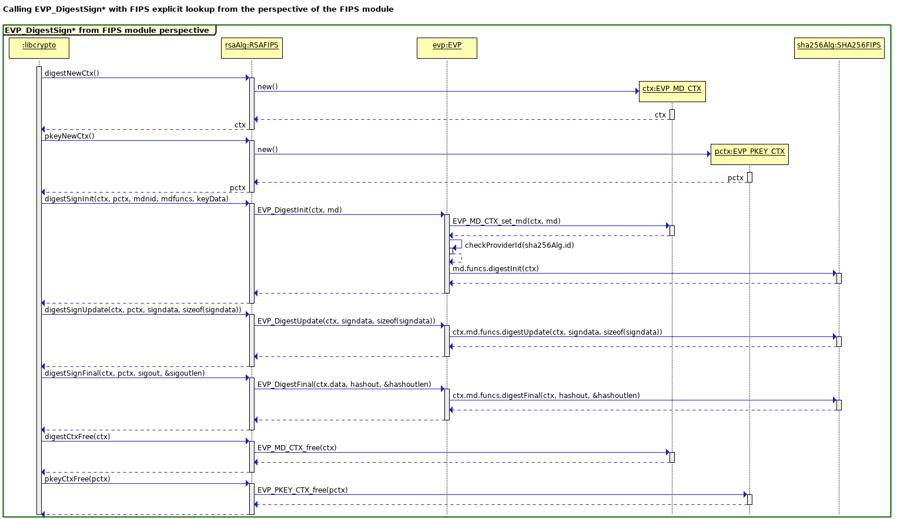

Note that within the FIPS module we are using EVP concepts
(EVP_MD_CTX, EVP_PKEY_CTX, etc) in order to implement this. These are
**copies** of the EVP implementation found in libcrypto. The FIPS
module is **not** linked against libcrypto. This is to ensure that the
complete operation stays within the boundary of the FIPS module
without calling code that is external to it.

### ASN.1 code {#asn.1-code}

ASN.1 DER (distinguished encoding rules) is used to:

*   serialize **keys **and **parameters**
*   serialize **DSA and ECDSA signatures**, which consist of two
    values, r and s
*   encode the signature digest OBJECT IDENTIFIER (OID) that is placed
    in **RSA PKCS #1 padding**
*   serialize X.509 certificates and CRLs
*   other PDUs, such as PKCS #7/CMS, OCSP, PKCS #12, etc.

The FIPS module will not have a copy of the ASN.1 DER encoder/parser
and there will be no requirement for any provider to perform ASN.1
serialization/deserialization for algorithms implemented by OpenSSL.

All ASN.1 serialization/deserialization will be performed in
libcrypto, with composite-value **key, parameter and signature**
structures crossing the Core/provider boundary as an array of items,
using the public data structure defined in
[Appendix 2 - OpenSSL parameter passing](#appendix-2---parameter-passing).

The encoded digest OIDs used for **RSA PKCS #1 padding** will either
be pre-generated (as was done in the old FIPS module using the SHA_DATA macro)
or generated on demand using a simple function that only generates
encoded OIDs for the small set of digests supported by PKCS #1
padding. These digest OIDs occur in the "OID tree" under a common
node. Verifying the padding will include getting the encoded OID for
the expected digest and comparing the bytes with what occurs in the
padding; no DER parsing/decoding is required.


## Code Maintenance {#code-maintenance}

### Source code structure/tree clean-up {#source-code-structure-tree-clean-up}

Cryptographic implementations (`crypto/evp/e_*.c` and most of
`crypto/evp/m_*.c`; essentially any code that defines an `EVP_CIPHER`,
`EVP_MD`, `EVP_PKEY_METHOD`, `EVP_MAC`, or `EVP_KDF`) must move out of
the evp directory.  They will all end up being part of one or two
providers, so they should end up in a provider specific sub-tree.

There will be a new directory `providers/`, where provider specific
code is moved.  `providers/build.info` defines exactly what source is
used in what provider module(s).

### Shared source code {#shared-source-code}

The FIPS provider module and the default provider will share the same
source, under different conditions, such as different include paths or
different macros being defined (the latter requires added support in
the build system).  An example `build.info` that does this:

```
PROVIDERS=p_fips p_default

SOURCE[p_fips]=foo.c
INCLUDE[p_fips]=include/fips

SOURCE[p_default]=foo.c
INCLUDE[p_default]=include/default
```

Or, using macros:

```
PROVIDERS=p_fips p_default

SOURCE[p_fips]=foo.c
DEFINE[p_fips]=FIPS_MODE

SOURCE[p_default]=foo.c
```

Note: some keywords aren't yet part of the `build.info` language.

### Conditional Code {#conditional-code}

We need a consistent approach to the compile-time inclusion of
FIPS-specific code, and in some cases the exclusion of code that FIPS
does not permit.

Compile-time controls will be done via `#ifdef FIPS_MODE`. This
ensures that all relevant files are compiled explicitly for non-FIPS
or for use within the FIPS module. Since every file will be compiled
twice (in the default provider, and in the FIPS module), once with
each setting, there is no benefit to using a run-time if statement
with constant value. (Further, a runtime setting will not always work
(such as when expanding macros like BLOCK_CIPHER_custom, which create
a global variable of function pointers.)

The build system will support this by building FIPS provider object
files with `-DFIPS_MODE` and default provider object files, which come
from the same source, without the command line define.

For runtime checks, a test for a TLS connection being in FIPS mode
will be required.  This can be done in a generic way by checking the
property query string that is associated with a specific `SSL_CTX` or
`SSL` object, to see if the "fips" property was set.

## FIPS Testing {#fips-testing}

The following types of tests are required:

*   CAVS testing for CMVP validated algorithms
*   FIPS Test Suite that can run all FIPS module algorithms.
*   POST failure testing.

Acumen will write applications that use libcrypto to gain access to
the FIPS provider via the EVP layer.

Any special case code needed to return intermediate values (say for
CAVS key generation), to display info (self test states), or change
the normal flow of FIPS module code (e.g - self test failure or
failing a keygen loop that supplies fixed rand values) will be
controlled by embedding callbacks into the FIPS module code.

It is recommended that this callback code would be conditionally
compiled into the module, since some of the values should not be
returned (e.g- intermediate values in keygen are not supposed to be
output by the FIPS module).

rand_bytes() will be overridden for tests that require fixed
rand_bytes to be used.

### FIPS Test callbacks {#fips-test-callbacks}


The application can optionally supply a single callback function that
can be used to process values received from the FIPS module. (Multiple
callbacks could be registered if this is required).

The optional application callback would be of the form:

``` C
static int fips_test_callback(const char *type, void *arg)
{
    return 1;
}
```

The return value can be used to control flow in special cases inside
the FIPS module code.

The type is passed in from the FIPS module hook. Each different hook
in the FIPS module should have  a unique type. The type determines
what the arg param contains (either a struct (e.g- intermediate
values), a name, or int.

The callback in the FIPS module will be of the form

``` C
MY_STRUCT  data;   /* values that need to be returned to the application */
data.i = 1;
.....
if (FIPS_test_cb != NULL)
    FIPS_test_cb(FIPS_TEST_CB_RSA_KEYGEN_GET, (void *)&data);
```

### POST Failure Testing and Logging. {#post-failure-testing-and-logging.}

In order to support the failure of multiple tests all tests will
always be run without early exiting (the failure is just flagged).  A
failure status will be returned after all the tests have completed.

For logging or failure, the args would be:

``` C
struct {
    const char *desc;
    const char *state;
    const char *fail_reason;
};
```

Where:

*   type is one of "post_integrity", "post_cipher", "post_digest",
    "post_signature", "post_drbg", ..
*   desc is the identifying name: e.g AES_128_CBC
*   state is one of
*   "start"  - indicates the test is starting
*   "corrupt" - if this returns 0 then the test will fail
*   "pass" - indicates the test passed
*   "fail" - indicates the test failed
*   fail_reason - is the specific reason for failure (e.g- unable to
    read the integrity module file, or integrity checksum file.)

### CAVS Testing {#cavs-testing}

CAVS testing will be performed by the lab.

However each CAVS tests file could also be sampled and added to the
unit tests. This would mean converting the file data of a single test
into binary data inside a unit test.

(DRBG_ctr is an example that does this already).

This will ensure the following:


*   The required interfaces will be available to the CAVS tests (some
    CAVS tests require access to internals, that are not normally
    needed).
*   That the algorithm works.
*   Coverage.

We could skip doing this if there is good communication with the lab,
but there may be some extra callback hooks required in the code if the
labs finds missing accessors for internals.

## Legacy {#legacy}

### EVP to low level API bridges {#evp-to-low-level-api-bridges}

There are places where low level API structures are assigned to an `EVP_PKEY`
object. The impact on the public `EVP_PKEY` is that it will have to keep a
pointer to a possible low level structure and the type of that low
level structure must be known internally in `libcrypto`.  Any time the
`EVP_PKEY` with such a pointer is used for any computation, it must
check if the low level structure has changed and convert its data to
parameters that can be used with the new providers.

The exact mechanism to check if the contents of a low level structure
has changed is to be determined.  One possibility would be to have a
dirty counter in the low level structure and a copy in the `EVP_PKEY`
structure.  The dirty counter gets incremented any time the low level
structure is changed (functions such as `RSA_set0_key` would have to
do the increment), and any time the `EVP_PKEY` is used for
computations, its copy of the counter get checked against the low
level dirty counter, and if they differ, the `EVP_PKEY` provider
parameters get modified with data from the low level structure.

(yet another idea is to have a callback function placed in the
`EVP_PKEY` by the legacy functions, which does the update of
parameters if it detects that low level changes have been made)

### EVP method creators {#evp-method-creators}

There is functionality to create diverse EVP method structures in
OpenSSL 1.1.x, easily found like this:


``` shell
grep EVP_CIPHER_meth util/libcrypto.num
grep EVP_MD_meth util/libcrypto.num
grep EVP_PKEY_meth util/libcrypto.num
```

### Associated types {#associated-types}

The low level APIs are fairly standalone, so all low level API types
will remain unchanged apart from an added dirty flag in some of the
types.  Associated `EVP_CIPHER`, `EVP_MD`, `EVP_PKEY_METHOD`,
`EVP_MAC`, or `EVP_KDF` instances are handled separately through the
implementation of dispatch tables in the Legacy provider module (see
below).


## Legacy Provider Module {#legacy-provider-module}

Some algorithms that are considered "legacy" (an example could be
IDEA) and that have current `EVP_CIPHER`, `EVP_MD`, `EVP_PKEY_METHOD`,
`EVP_MAC`, or `EVP_KDF` implementations will move to a Legacy provider
module rather than our default provider module.

The methods for the following algorithms will become dispatch tables
in the Legacy provider module:

1.  Blowfish
2.  CAST
3.  DES (but not 3DES)
4.  DSA
5.  IDEA
6.  MD2
7.  MD4
8.  MDC2
9.  RC2
10. RC4
11. RC5
12. RIPEMD160
13. SEED
14. Whirlpool

(note: this is not meant to be an exhaustive list, even though fairly
complete _for the moment_)

## The ENGINE API {#the-engine-api}

The whole ENGINE API will be deprecated and removed in the major
release after this one.  By then, people will have to have learned how
to create provider modules instead. In the meantime, it will be
transformed into a tool to help implementers to transition from an
ENGINE module implementation to a provider module implementation.

Because algorithm constructors will be changed to construct dispatch
tables, the ENGINE type will change into a collection of dispatch
tables, and the ENGINE constructor functionality will change to
collect the dispatch tables they get into the given ENGINE.

Dispatch tables registered this way will get the added property
_engine_ with the ENGINE identity as provider name property.  That
will make it possible for `ENGINE_by_id` and similar functionality to
find the correct provider.

The ENGINE module entry point `bind_engine` will be replaced with the
provider module entry point, and the macro `IMPLEMENT_DYNAMIC_BIND_FN`
will be changed to construct such an entry point.  This entry point
will create a provider style ENGINE structure, call the binding
function which will fill it up with dispatch tables using the same
method creation functions it has always used, then register all those
dispatch tables collected in the ENGINE structure just like any
provider module would, using the same method setting functions as
before.

As with the rest of this release, our goal is source-level
compatibility.

With OpenSSL 1.1.x and older, it's possible to hook in ENGINE provided
methods to be used instead of the functions built into `libcrypto`,
using functions like `ENGINE_get_default_RSA` and `ENGINE_get_RSA`.
The first of the two needs no modification, while the latter will be
changed to create the old-style methods (such as `RSA_METHOD`) from
the corresponding dispatch table attached to the engine.

# Appendix 1 - Property Syntax {#appendix-1---property-syntax}

Property definitions and queries have a well defined syntax.  This
section presents this in both eBNF and as railroad diagrams.  Okay,
almost eBNF but using regular expression extensions in places.

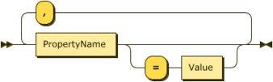{style="float: right; padding-left: 20px"}

**Definition**

```
Definition
      ::= SingleDefinition ( ',' SingleDefinition )*

SingleDefinition
      ::= PropertyName ( '=' Value )?
```

<br clear="all" />

-----

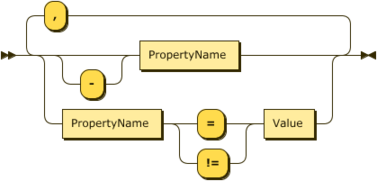{style="float: right; padding-left: 20px"}

**Query**

```
Query ::= SingleQuery ( ',' SingleQuery )*

SingleQuery
      ::= '-'? PropertyName
        | PropertyName ( '=' | '!=' ) Value )
```

<br clear="all" />

-----

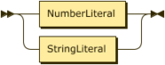{style="float: right; padding-left: 20px"}

**Value**

```
Value ::= NumberLiteral
        | StringLiteral
```

<br clear="all" />

-----

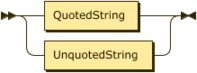{style="float: right; padding-left: 20px"}

**StringLiteral**

```
StringLiteral
      ::= QuotedString
        | UnquotedString
```

<br clear="all" />

-----

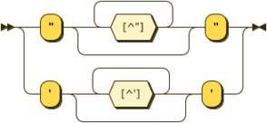{style="float: right; padding-left: 20px"}

**QuotedString**[^4]

```
QuotedString
      ::= '"' [^"]* '"'
        | "'" [^']* "'"
```

<br clear="all" />

-----

{style="float: right; padding-left: 20px"}

**UnquotedString**[^5]

```
UnquotedString
      ::= [^{space},]+
```

<br clear="all" />

-----

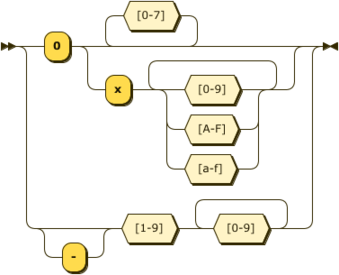{style="float: right; padding-left: 20px"}

**NumberLiteral**

```
NumberLiteral
      ::= '0' ( [0-7]+ | 'x' [0-9A-Fa-f]+ )
        | '-'? [1-9] [0-9]+
```

<br clear="all" />

-----

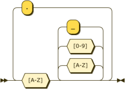{style="float: right; padding-left: 20px"}

**PropertyName**[^6]

```
PropertyName
      ::= [A-Z] [A-Z0-9_]* ( '.' [A-Z] [A-Z0-9_]* )*
```

<br clear="all" />

# Appendix 2 - Parameter Passing {#appendix-2---parameter-passing}

Core or provider objects are supposed to be opaque to everything
outside, and yet, we will need to be able to get parameters from them,
or to pass parameters to them in a uniform way.  We therefore need an
intermediary non-opaque structure to support this.

The types of data passed need to remain simple:

*   Numbers (integers of arbitrary size)
*   Character strings (assume UTF-8 encoding)
*   Octet strings (byte arrays of arbitrary size)

Any parameter that's passing values to a module will need the
following items:

*   An identifier, to indicate what parameter is being passed
*   The type of the value (from the list above)
*   The size of the value
*   The value itself

Any parameters that are used to request values _from_ a module will
need the following items:

*   An identifier to indicate what is being requested
*   The type of the value (from the list above)
*   The size of the buffer
*   A buffer where the values get filled in
*   The resultant output size, to be filled in by the function we ask
    for parameters from

These two structure are similar enough to be expressed as one and the same:

``` C
typedef struct ossl_param_st {
    const char *key;
    unsigned char data_type;    /* declare what kind of content is sent or
                                   expected */
    void *buffer;               /* value being passed in
                                   or out */
    size_t buffer_size;         /* buffer size */
    size_t *return_size;        /* OPTIONAL: address to
                                   content size */
} OSSL_PARAM;
```

Usage examples:

``` C
    /* passing parameters to a module */
    unsigned char *rsa_n = /* memory allocation */
#if __BYTE_ORDER == __LITTLE_ENDIAN
    size_t rsa_n_size = BN_bn2lebinpad(N, rsa_n, BN_num_bytes(rsa_n));
#else
    size_t rsa_n_size = BN_bn2bin(N, rsa_n);
#endif
    struct OSSL_PARAM rsa_params[] = {
        { RSA_N, OSSL_PARAM_INTEGER, rsa_n, rsa_n_size, NULL },
        { 0, 0, 0, 0, 0 },
    };

    EVP_set_params(pkey, rsa_params);

    /* requesting parameters from a module */
    size_t rsa_n_buffer_size = BITS / 2 / 8 + 1;
    unsigned char *rsa_n_buffer =
       OPENSSL_malloc(rsa_n_size);
    size_t rsa_n_size = 0;
    OSSL_PARAM rsa_params[] = {
        { RSA_N, OSSL_PARAM_INTEGER, rsa_n_buffer, rsa_n_buffer_size,
          &rsa_n_size },
        { 0, 0, 0, 0, 0 },
    };

    EVP_get_params(pkey, rsa_params);
    
    /*
     * Note: we could also have a ctrl functionality:
     * EVP_ctrl(pkey, EVP_CTRL_SET_PARAMS, rsa_params);
     * EVP_ctrl(pkey, EVP_CTRL_GET_PARAMS, rsa_params);
     *
     * This would allow other controls using the same API.
     * For added flexibility, the signature could be something like:
     *
     * int EVP_ctrl(EVP_CTX *ctx, int cmd, ...);
     */
```

## Data types {#data-types}


This specification supports the following parameter types:


*   `INTEGER`
*   `UNSIGNED_INTEGER`
    *   These are arbitrary length and may therefore require an
        arbitrarily sized buffer.
    *   The number is stored in native form, i.e. MSB first on big
        endian systems and LSB first on little endian systems.  This
        means that arbitrary native integers can be stored in the
        buffer, just make sure that the buffer size is correct and
        properly aligned.
*   `REAL`
    *   These store C binary floating point values in their native
        format and alignment.
*   `UTF8_STRING`
    *   This type of string is expected to be printable as is.
*   `OCTET_STRING`
    *   When printed, this is expected to become a hexdump.

We also support pointer variants of the same types (which means that
the `OSSL_PARAM` `buffer` only has to have space for a `void *`).
This use is _fragile_ unless the pointed at values are constant over
time.

We have macros to declare the type of content in `data_type`:

``` C
#define OSSL_PARAM_INTEGER              1
#define OSSL_PARAM_UNSIGNED_INTEGER     2
#define OSSL_PARAM_UTF8_STRING          3
#define OSSL_PARAM_OCTET_STRING         4
/*
 * This one is combined with one of the above, i.e. to get a string pointer:
 * OSSL_PARAM_POINTER | OSSL_PARAM_UTF8_STRING
 */
#define OSSL_PARAM_POINTER           0x80
```

## Implementation details {#implementation-details}

### Determining the size of the buffer {#determining-the-size-of-the-buffer}

When requesting parameter values, the caller may choose to assign
`NULL` to `buffer` in one or more parameter structures.  The called
getter should answer such a request by filling in the size pointed at
by `return_size` and return, at which point the caller can allocate
appropriately sized buffers and make a second call, at which point the
getter can fill in the buffer with no problem.

If the programmer wants,  `return_size` could be made to point at
`buffer_size` in the same `OSSL_PARAM`.

## Uses beyond the immediately obvious {#uses-beyond-the-immediately-obvious}

### CONF / NCONF values as parameters {#conf-nconf-values-as-parameters}

Configuration values are interesting to providers!  And yet, just
passing a CONF pointer between the Core and the provider may not be
feasible, even though it's _currently_ a non-opaque structure.

Another method could be to make the CONF / NCONF values into
parameters, with a bit of inspiration from git config value names.

Let's start with imagining a provider configuration along the same
lines as the what the current ENGINE configuration module supports:

```
[provider_section]
# Configure provider named "foo"
foo = foo_section
# Configure provider named "bar"
bar = bar_section

[foo_section]
provider_id = myfoo
module_path = /usr/lib/openssl/providers/foo.so
selftests = foo_selftest_section
algorithms = RSA, DSA, DH

[foo_selftest_section]
doodah = 1
cookie = 0
```

The Core side provider structure for the provider "foo" could then
answer to these requested parameter keys:

*   `"provider_id"` (value is `"myfoo"`)
*   `"module_path"` (value is `"/usr/lib/openssl/providers/foo.so"`)
*   `"selftests.doodah"` (value is `1`)
*   `"selftests.cookie"` (value is `0`)
*   `"algorithms"` (value is `"RSA, DSA, DH"`)

Note that the section names themselves never appear in the parameter
key, but that the key that lead to the section does instead.  This is
suggested because OpenSSL allows arbitrarily named section names.

## The tooth of time {#the-tooth-of-time}

The parameter structure defined above isn't something that's been
invented on the spot.  It's highly inspired from OpenVMS programming
paradigms that have proven stable over time.  The actual inspiring
structure is called "item_list_3", which is documented here:
[OpenVMS Programming Concepts Manual, Volume I](https://support.hpe.com/hpsc/doc/public/display?docId=emr_na-c04621447)

# Appendix 3 - Algorithms {#appendix-3---algorithms}

The algorithms which are to be included in the FIPS module are:

<!-- this remains a table in markdown to get colspan and rowspan -->
<table>
  <tr>
   <td colspan="2" ><strong>Requirement</strong>
   </td>
   <td><strong>Standard</strong>
   </td>
   <td><strong>Compliant</strong>[^7]<strong> </strong>
   </td>
   <td><strong>Notes</strong>
   </td>
  </tr>
  <tr>
   <td>TDES
   </td>
   <td>CBC
   </td>
   <td><a href="https://csrc.nist.gov/publications/detail/fips/81/archive/1980-12-02">FIPS 81</a>
   </td>
   <td>✓
   </td>
   <td rowspan="2" >Refer also to <a href="https://csrc.nist.gov/publications/detail/sp/800-67/rev-2/final">SP 800-67rev2</a>. \
 \
TDES support being decryption only (from 2020) and banned (from 2025). \
 \
Limits to data length imposed.
<p>
Security Policy statement regarding the <a href="https://csrc.nist.gov/publications/detail/sp/800-67/rev-1/archive/2012-01-23">SP 800-67rev1 </a>transition and limitations will be required.
   </td>
  </tr>
  <tr>
   <td>
   </td>
   <td>ECB
   </td>
   <td><a href="https://csrc.nist.gov/publications/detail/fips/81/archive/1980-12-02">FIPS 81</a>
   </td>
   <td>✓
   </td>
  </tr>
  <tr>
   <td>AES
   </td>
   <td>CBC
   </td>
   <td><a href="https://csrc.nist.gov/publications/detail/sp/800-38a/final">SP 800-38A</a>
   </td>
   <td>✓
   </td>
   <td>All AES cipher modes supporting 128, 192 and 256 bits.
   </td>
  </tr>
  <tr>
   <td>
   </td>
   <td>CBC CTS
   </td>
   <td>
   </td>
   <td>✓
   </td>
   <td>
   </td>
  </tr>
  <tr>
   <td>
   </td>
   <td>CCM
   </td>
   <td><a href="https://csrc.nist.gov/publications/detail/sp/800-38c/final">SP 800-38C</a>
   </td>
   <td>✓
   </td>
   <td>
   </td>
  </tr>
  <tr>
   <td>
   </td>
   <td>CFB
   </td>
   <td><a href="https://csrc.nist.gov/publications/detail/sp/800-38a/final">SP 800-38A</a>
   </td>
   <td>✓
   </td>
   <td>
   </td>
  </tr>
  <tr>
   <td>
   </td>
   <td>CTR
   </td>
   <td><a href="https://csrc.nist.gov/publications/detail/sp/800-38a/final">SP 800-38A</a>
   </td>
   <td>✓
   </td>
   <td>
   </td>
  </tr>
  <tr>
   <td>
   </td>
   <td>ECB
   </td>
   <td><a href="https://csrc.nist.gov/publications/detail/sp/800-38a/final">SP 800-38A</a>
   </td>
   <td>✓
   </td>
   <td>
   </td>
  </tr>
  <tr>
   <td>
   </td>
   <td>GCM
   </td>
   <td><a href="https://csrc.nist.gov/publications/detail/sp/800-38d/final">SP 800-38D</a>
   </td>
   <td>✓
   </td>
   <td>Changes in IV. Module must generate the IV.
   </td>
  </tr>
  <tr>
   <td>
   </td>
   <td>GMAC
   </td>
   <td><a href="https://csrc.nist.gov/publications/detail/sp/800-38d/final">SP 800-38D</a>
   </td>
   <td>✓
   </td>
   <td>
   </td>
  </tr>
  <tr>
   <td>
   </td>
  <tr>
   <td>
   </td>
   <td>OFB
   </td>
   <td><a href="https://csrc.nist.gov/publications/detail/sp/800-38a/final">SP 800-38A</a>
   </td>
   <td>✓
   </td>
   <td>
   </td>
  </tr>
   <td>XTS
   </td>
   <td><a href="https://csrc.nist.gov/publications/detail/sp/800-38e/final">SP 800-38E</a>
   </td>
   <td>✓
   </td>
   <td>See <a href="https://csrc.nist.gov/CSRC/media/Projects/Cryptographic-Module-Validation-Program/documents/fips140-2/FIPS1402IG.pdf">FIPS 140-2 I.G.</a> A.9.  Needs key check added.  This mode does not support 192 bits.  Check added by <a href="https://github.com/openssl/openssl/pull/7120">#7120</a>.
   </td>
  </tr>
  <tr>
   <td>
   </td>
   <td>KW
   </td>
   <td><a href="https://csrc.nist.gov/publications/detail/sp/800-38f/final">SP 800-38F</a>
   </td>
   <td>✓
   </td>
   <td rowspan="2" >Differences from standard but within it.
   </td>
  </tr>
  <tr>
   <td>
   </td>
   <td>KWP
   </td>
   <td><a href="https://csrc.nist.gov/publications/detail/sp/800-38f/final">SP 800-38F</a>
   </td>
   <td>✓
   </td>
  </tr>
  <tr>
   <td>Hash
   </td>
   <td>SHA-1
   </td>
   <td><a href="http://nvlpubs.nist.gov/nistpubs/FIPS/NIST.FIPS.180-4.pdf">FIPS 180-4</a>
   </td>
   <td>✓
   </td>
   <td>
   </td>
  </tr>
  <tr>
   <td>
   </td>
   <td>SHA-2
   </td>
   <td><a href="http://nvlpubs.nist.gov/nistpubs/FIPS/NIST.FIPS.180-4.pdf">FIPS 180-4</a>
   </td>
   <td>✓
   </td>
   <td>224, 256, 384, 512.
   </td>
  </tr>
  <tr>
   <td>
   </td>
   <td>SHA-2
   </td>
   <td><a href="http://nvlpubs.nist.gov/nistpubs/FIPS/NIST.FIPS.180-4.pdf">FIPS 180-4</a>
   </td>
   <td>✓
   </td>
   <td>512/224, 512/256.  Appear to be compliant.
   </td>
  </tr>
  <tr>
   <td>
   </td>
   <td>SHA-3
   </td>
   <td><a href="https://nvlpubs.nist.gov/nistpubs/FIPS/NIST.FIPS.202.pdf">FIPS 202</a>
   </td>
   <td>✓
   </td>
   <td>224, 256, 384, 512.  Appear to be compliant.
   </td>
  </tr>
  <tr>
   <td>HMAC
   </td>
   <td>SHA-1
   </td>
   <td><a href="https://www.nist.gov/publications/keyed-hash-message-authentication-code-hmac-0?pub_id=901614">FIPS 198-1</a>
   </td>
   <td>✓
   </td>
   <td>
   </td>
  </tr>
  <tr>
   <td>
   </td>
   <td>SHA-2
   </td>
   <td><a href="https://www.nist.gov/publications/keyed-hash-message-authentication-code-hmac-0?pub_id=901614">FIPS 198-1</a>
   </td>
   <td>✓
   </td>
   <td>224, 256, 384, 512.
   </td>
  </tr>
  <tr>
   <td>
   </td>
   <td>SHA-3
   </td>
   <td><a href="https://www.nist.gov/publications/keyed-hash-message-authentication-code-hmac-0?pub_id=901614">FIPS 198-1</a>
   </td>
   <td>✓
   </td>
   <td>
   </td>
  </tr>
  <tr>
   <td>CMAC
   </td>
   <td>
   </td>
   <td>
   </td>
   <td>✓
   </td>
   <td>
   </td>
  </tr>
  <tr>
   <td>GMAC
   </td>
   <td>
   </td>
   <td>
   </td>
   <td>✓
   </td>
   <td>
   </td>
  </tr>
  <tr>
   <td>KMAC
   </td>
   <td>
   </td>
   <td>
   </td>
   <td>✓
   </td>
   <td>
   </td>
  </tr>
  <tr>
   <td>DRBG
   </td>
   <td>AES CTR
   </td>
   <td><a href="https://csrc.nist.gov/publications/detail/sp/800-90a/rev-1/final">SP 800-90A</a>
   </td>
   <td>✓
   </td>
   <td rowspan="3" >Issues with <a href="https://csrc.nist.gov/publications/detail/sp/800-90c/draft">SP 800-90C</a>.
<p>
All comply with <a href="https://csrc.nist.gov/publications/detail/sp/800-90a/rev-1/final">SP 800-90A</a>.
   </td>
  </tr>
  <tr>
   <td>
   </td>
   <td>Hash
   </td>
   <td><a href="https://csrc.nist.gov/publications/detail/sp/800-90a/rev-1/final">SP 800-90A</a>
   </td>
   <td>✓
   </td>
  </tr>
  <tr>
   <td>
   </td>
   <td>HMAC
   </td>
   <td><a href="https://csrc.nist.gov/publications/detail/sp/800-90a/rev-1/final">SP 800-90A</a>
   </td>
   <td>✓
   </td>
  </tr>
  <tr>
   <td>DRBG
   </td>
   <td>Testing
   </td>
   <td>SP 800-90
   </td>
   <td>✗
   </td>
   <td>Support DRBG health test as per current version of these standards: <a href="https://csrc.nist.gov/publications/detail/sp/800-90a/rev-1/final">A</a>, <a href="https://csrc.nist.gov/publications/detail/sp/800-90b/final">B</a> & <a href="https://csrc.nist.gov/publications/detail/sp/800-90c/draft">C</a>.
   </td>
  </tr>
  <tr>
   <td>RSA
   </td>
   <td>
   </td>
   <td><a href="https://nvlpubs.nist.gov/nistpubs/FIPS/NIST.FIPS.186-4.pdf">FIPS 186-4</a>
   </td>
   <td>✓
   </td>
   <td>Refer also to <a href="https://csrc.nist.gov/publications/detail/sp/800-56b/rev-2/draft">SP 800-56B</a>.  PKCS#1.5, PSS, Key pair generation.  Modulus size changes.
   </td>
  </tr>
  <tr>
   <td>
   </td>
   <td>Key wrap (transport)
   </td>
   <td><a href="https://csrc.nist.gov/publications/detail/sp/800-56b/rev-2/draft">SP 800-56B</a>
   </td>
   <td>✓
   </td>
   <td>OAEP.  Update to <a href="https://csrc.nist.gov/publications/detail/sp/800-56b/rev-2/draft">SP 800-56B rev-1</a> standard.
   </td>
  </tr>
  <tr>
   <td>DH
   </td>
   <td>KAS
   </td>
   <td><a href="https://csrc.nist.gov/publications/detail/sp/800-56a/rev-3/final">SP 800-56A</a>
   </td>
   <td>✓
   </td>
   <td>Update to <a href="https://csrc.nist.gov/publications/detail/sp/800-56a/rev-3/final">SP 800-56A rev-3</a> standard.
   </td>
  </tr>
  <tr>
   <td>
   </td>
   <td>KAS
   </td>
   <td><a href="https://csrc.nist.gov/CSRC/media/Projects/Cryptographic-Algorithm-Validation-Program/documents/keymgmt/KASVS.pdf">KASVS</a>
   </td>
   <td>✓
   </td>
   <td>Additional testing to meet ZZonly.  CVL/KAS.
   </td>
  </tr>
  <tr>
   <td>DSA
   </td>
   <td>
   </td>
   <td><a href="https://nvlpubs.nist.gov/nistpubs/FIPS/NIST.FIPS.186-4.pdf">FIPS 186-4</a>
   </td>
   <td>✓
   </td>
   <td>PQG generation & verification, signature generation & verification, key pair generation.
   </td>
  </tr>
  <tr>
   <td>ECDSA
   </td>
   <td>
   </td>
   <td><a href="https://nvlpubs.nist.gov/nistpubs/FIPS/NIST.FIPS.186-4.pdf">FIPS 186-4</a>
   </td>
   <td>✓
   </td>
   <td>Key pair generation, public key generation, signature generation & verification.
   </td>
  </tr>
  <tr>
   <td>ECC
   </td>
   <td>KAS
   </td>
   <td><a href="https://csrc.nist.gov/publications/detail/sp/800-56a/rev-3/final">SP 800-56A</a>
   </td>
   <td>✓
   </td>
   <td>B-233, 283, 409, 571; K-233, 283, 409, 571; P-224, 256, 384, 521.  Update to <a href="https://csrc.nist.gov/publications/detail/sp/800-56a/rev-3/final">SP 800-56A rev-3</a> standard.
   </td>
  </tr>
  <tr>
   <td>
   </td>
   <td>KAS
   </td>
   <td><a href="https://csrc.nist.gov/CSRC/media/Projects/Cryptographic-Algorithm-Validation-Program/documents/keymgmt/KASVS.pdf">KASVS</a>
   </td>
   <td>✓
   </td>
   <td>Additional testing to meet ZZonly.  CVL/KAS.
   </td>
  </tr>
  <tr>
   <td>KDF
   </td>
   <td>PBKDF2
   </td>
   <td><a href="https://csrc.nist.gov/publications/detail/sp/800-132/final">SP 800-132</a>
   </td>
   <td>✓
   </td>
   <td>Verify conformance with standards.  See <a href="https://github.com/openssl/openssl/pull/6674">#6674</a>.
   </td>
  </tr>
  <tr>
   <td>
   </td>
   <td>HKDF
   </td>
   <td>
   </td>
   <td>✓
   </td>
   <td>
   </td>
  </tr>
  <tr>
   <td>
   </td>
   <td>SSKDF
   </td>
   <td>
   </td>
   <td>✓
   </td>
   <td>
   </td>
  </tr>
  <tr>
   <td>
   </td>
   <td>SSHKDF
   </td>
   <td>
   </td>
   <td>✓
   </td>
   <td>
   </td>
  </tr>
  <tr>
   <td>
   </td>
   <td>X9.42 KDF
   </td>
   <td>
   </td>
   <td>✓
   </td>
   <td>
   </td>
  </tr>
  <tr>
   <td>
   </td>
   <td>X9.63 KDF
   </td>
   <td>
   </td>
   <td>✓
   </td>
   <td>
   </td>
  </tr>
  <tr>
   <td>
   </td>
   <td>KBKDF
   </td>
   <td>
   </td>
   <td>✓
   </td>
   <td>
   </td>
  </tr>
  <tr>
   <td>
   </td>
   <td>TLS PRF
   </td>
   <td>
   </td>
   <td>✓
   </td>
   <td>
   </td>
  </tr>
  <tr>
   <td>TLS
   </td>
   <td>PRF
   </td>
   <td>
   </td>
   <td>✓
   </td>
   <td>For TLS 1.2 and 1.3.
   </td>
  </tr>
</table>

<!-- Footnotes themselves at the bottom. -->
# Notes {#notes}

[^1]: The output of the DRBGs are not required to be tested because of
    [FIPS 140-2 IG](https://csrc.nist.gov/csrc/media/projects/cryptographic-module-validation-program/documents/fips140-2/fips1402ig.pdf)
    9.8.  However, the seed material being fed into the master DRBG
    still requires the RCT or stuck bit testing.

[^2]: The draft guidance has changed. The alternatives are: AES_GMAC,
    AES_128_CCM, AES_256_GCM and AES_256_CCM.  GMAC is arguably the
    simplest of the three and thus might be preferable.

[^3]: Using a different digest algorithm for HASH and HMAC DRBGs would
    obviate the need to test the digest independently.

[^4]: Quoted strings can contain UTF-8 characters.

[^5]: Unquoted strings are passed through a lower case conversion and
    can only contain ASCII characters.

[^6]: Property names are case insensitive even though only upper case
    is depicted here.

[^7]: Current from a CMVP perspective.

