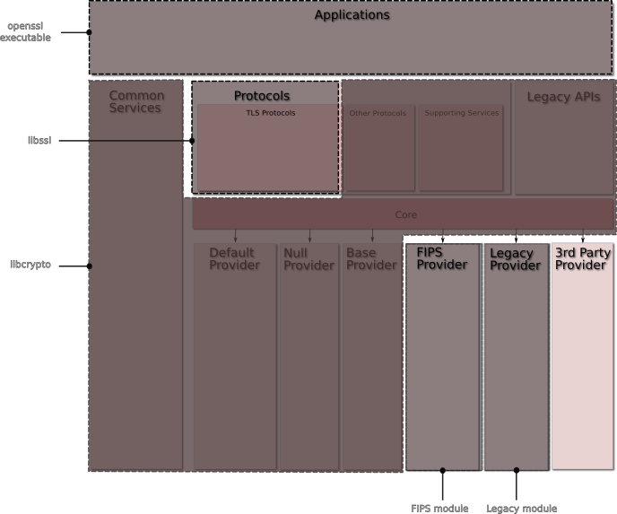

## Introduction

This document outlines the OpenSSL strategic architecture. It will take
multiple releases, starting from 3.0.0, to move the architecture from
the current "as-is" (1.1.1), to the future "to-be" architecture.

Numerous changes are anticipated in the to-be architecture. A migration
path for handling the eventual transition will be provided. The OpenSSL
3.0.0 release will have minimal impact to the vast majority of existing
applications, almost all well-behaved applications will just need to be
recompiled.

The current functionality provided by the engine interface will be
replaced over time via a provider interface. OpenSSL 3.0.0 will continue
to support engines. The to-be architecture will not be fully realised
until OpenSSL 4.0.0 at the earliest.

## As-is architecture

Currently, OpenSSL is split into four principal components:

1.  libcrypto. This is the core library for providing implementations of
    numerous cryptographic primitives. In addition it provides a set of
    supporting services which are used by libssl and libcrypto, as well
    as implementations of protocols such as CMS and OCSP.

2.  Engine. The functionality of libcrypto can be extended through the
    Engine API.

    Typically engines are dynamically loadable modules that are registered
    with libcrypto and use the available hooks to provide cryptographic
    algorithm implementations. Usually these are alternative implementations
    of algorithms already provided by libcrypto (e.g. to enable hardware
    acceleration of the algorithm), but they may also include algorithms not
    implemented in default OpenSSL (e.g. the GOST engine implements the GOST
    algorithm family). Some engines are provided as part of the OpenSSL
    distribution, and some are provided by external third parties (again,
    GOST).

3.  libssl. This library depends on libcrypto and implements the TLS and
    DTLS protocols.

4.  Applications. The applications are a set of command line tools that
    use the underlying libssl and libcrypto components to provide a set
    of cryptographic and other features such as:
    a.  Key and parameter generation and inspection
    b.  Certificate generation and inspection
    c.  SSL/TLS test tools
    d.  ASN.1 inspection
    e.  Etc

Currently, OpenSSL has the following characteristics:

1.  EVP. The EVP (envelope) API level provides the high-level abstract
    interface to cryptographic functionality separate from the concrete
    implementation binding. Direct use of concrete cryptographic
    algorithm implementations via interfaces other than the EVP layer is
    discouraged. The EVP layer also provides composite operations, such
    as signing and verifying. Certain composite operations are also
    provided as an EVP-level operation (such as HMAC-SHA256). EVP also
    allow use of cryptographic algorithms in an algorithm-agnostic
    manner (e.g. EVP\_DigestSign works for both RSA and ECDSA
    algorithms).

2.  FIPS140 is not supported. FIPS140 it is only available in
    OpenSSL-1.0.2 which predates the as-is architecture and is not API
    or ABI compatible.

### Conceptual Component View

The existing architecture is a simple 4 level layering with the crypto
layer at the bottom. The TLS layer depends on the crypto layer, and the
applications depend on both the TLS and crypto layers.

Note: the existence of a component in the diagram does not indicate that
the component is a public API or intended for end-user direct access or
usage.

### Packaging View

The components described above are packaged into libraries (libcrypto
and libssl) and associated engine interfaces as well as an "openssl"
command line executable for running the various applications. This is
illustrated in the diagram below.

## To-be Architecture

The to-be architecture has the following features:

-   Core Services form the building blocks usable by applications and
    providers. (e.g. BIO, X509, SECMEM, ASN1, etc).

-   Providers implement cryptographic algorithms and supporting
    services. A provider has implementations of one or more of the
    following:

    -   The cryptographic primitives for an algorithm, e.g. how to
        encrypt/decrypt/sign/hash etc.
    -   Serialisation for an algorithm, e.g. how to convert a private
        key into a PEM file. Serialisation could be to or from formats
        that are not currently supported.
    -   Store loader back ends. OpenSSL currently has a store loader
        that reads keys, parameters and other items from files.
        Providers could have a loader to load from another location
        (e.g. LDAP directory).

    A Provider may be entirely self-contained or it may use services that
    are provided by different providers or the Core Services. For example,
    an application may use the cryptographic primitives for an algorithm
    implemented by a hardware accelerated provider, but use the
    serialisation services of a different provider in order to export keys
    into PKCS\#12 format.

    A default provider (which contains the core of the current OpenSSL
    cryptographic algorithm implementations) will be "built-in" but other
    providers will be able to be dynamically loadable at runtime.

    Legacy provider module(s) will provide cryptographic implementations for
    older algorithms (e.g., DES, MDC2, MD2, Blowfish, CAST). The OMC will
    publish a policy for how and when algorithms are transitioned from the
    default provider to the legacy provider.

    A FIPS provider that embodies the OpenSSL FIPS Cryptographic Module will
    be able to be dynamically loaded at runtime.

-   The Core enables access to the services offered by providers to
    applications (and other providers). Providers make methods available
    to the Core. The Core is the mechanism via which concrete
    implementations of where things such as algorithms are located.

    The Core will implement a property based look-up feature for finding
    algorithms, e.g. it might allow you find an algorithm where "fips=true",
    or "keysize=128, constant\_time=true". The details of this will be
    determined in later design documents.

-   Protocol implementations. E.g. TLS, DTLS.

The to-be architecture has the following characteristics:

-   The EVP layer becomes a thin wrapper for services implemented in the
    providers. Most calls are passed straight through with little/no
    pre- or post-processing.

-   New EVP APIs will be provided to find the implementation of an
    algorithm in the Core to be used for any given EVP call.

-   Information will be passed between the core library and the
    providers in an implementation agnostic way.

-   Legacy APIs (e.g. low level cryptographic APIs that do not go via
    the EVP layer) will be deprecated. Note that there are legacy APIs
    to non legacy algorithms (e.g. AES is a non-legacy algorithm but
    AES\_encrypt is a legacy API).

-   The OpenSSL FIPS Cryptographic Module will be implemented as a
    dynamically loaded provider. It will be self-contained (i.e. can
    only depend on system runtime libraries and services provided by the
    Core).

-   Other interfaces may also be transitioned to use the Core over time
    (for example OSSL\_STORE might be considered for this).

-   Engine usage will evolve to providers. "*Bye-bye-Engines,
    Hello-Providers".*

### Conceptual Component View

An overview of the conceptual components in the OpenSSL to-be
architecture is as shown in the (pink nirvana) diagram below.

Note: the existence of a component in the diagram does not indicate that
the component is a public API or intended for end-user direct access or
usage.

The components shown here are as follows:

-   Applications: Command line applications, e.g. ca, ciphers, cms, dgst
    etc

-   Protocols: Provides capabilities for communicating between endpoints
    according to standard protocols

    -   TLS Protocols: An implementation of all supported TLS/DTLS
        protocols and supporting infrastructure such as:
        -   SSL BIO: A BIO for communication using TLS
        -   Statem: The TLS state machine
        -   Record: The TLS record layer
    -   Other Protocols
        -   CMS: An implementation of the Cryptographic Message Syntax
            standard
        -   OCSP: An implementation of Online Certificate Status
            Protocol
        -   TS: An implementation of the Timestamp Protocol
    -   Supporting Services: Components specifically designed to support
        the implementation of protocol code
        -   Packet: Internal component for reading protocol messages
        -   Wpacket: Internal component for writing protocol messages

-   Core: This is a fundamental component that connects requests for a
    service (such as encryption) to a provider of that service. It
    implements the ability for providers to register their services
    along with the properties of those services. It also provides the
    ability to locate a service given a set of properties that the
    service must fulfil. For example, properties of an encryption
    service might include "aead", "aes-gcm", "fips",
    "security-bits=128", etc.

-   Default Provider: Implements a set of default services that are
    registered with the Core.

    -   Supporting Services
        -   Low Level Implementations: This is the set of components
            that actually implement the cryptographic primitives.

-   FIPS Provider: Implements a set of services that are FIPS validated
    and made available to the Core. This includes the following
    supporting services:

    -   POST: Power On Self Test
    -   KAT: Known Answer Tests
    -   Integrity Check
    -   Low Level Implementations: This is the set of components that
        actually implement the cryptographic primitives (to meet the
        FIPS-mandated self-contained requirement).

-   Legacy Provider: Provides implementations of older algorithms that
    will be exposed via EVP-level APIs.

-   Third-Party Provider: Not part of the OpenSSL distribution. Third
    Parties may implement their own providers.

-   Common Services: these form the building blocks usable by
    applications and providers. (e.g. BIO, X509, SECMEM, ASN1, etc).

-   Legacy APIs. The "low-level" APIs. The "legacy" here refers to the
    API, not the algorithm itself. For example, AES is not a legacy
    algorithm but it has a legacy API (e.g. AES\_encrypt).

### Packaging View

The various components described in the conceptual component view above
are physically packaged into:

-   Executable application(s) for use by users

-   Libraries for use by application(s)

-   Dynamically loadable module(s) for use by the Core.

The physical packages shown here are:

-   Openssl executable. The command line application.

-   Libssl. This contains everything directly related to TLS and DTLS.
    Its contents will be largely the same as libssl in the as-is
    architecture. Note that some supporting services will be moved to
    libcrypto.

-   Libcrypto. This library contains the following components:

    -   Implementations of the core services such as: X509, ASN1, EVP,
        OSSL\_STORE etc
    -   The Core
    -   Protocols not related to TLS or DTLS
    -   Protocol supporting services (e.g. Packet and Wpacket)
    -   The default provider containing implementations of all the
        default algorithms

-   Libcrypto-legacy. Provides the legacy "low-level" APIs.
    Implementations of the algorithms for these APIS may come from any
    provider.

-   FIPS module. This contains the FIPS Provider that implements a set
    of services that are FIPS validated and are registered with the
    Core.

-   Legacy module. This contains the legacy provider.
